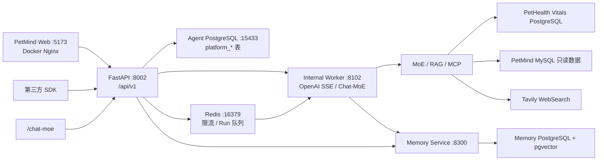
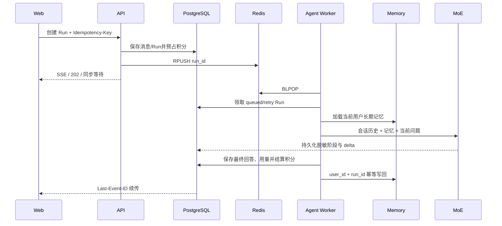

# PetMind 兽医 Agent 生产平台维护文档

> 最后全量核对：2026-08-23（Asia/Shanghai）
>
> Docker Nginx 部署复核：2026-08-18（Asia/Shanghai）
>
> 仓库：`C:\Users\ROG\Animal_detection2`
>
> Agent 工作目录：`C:\Users\ROG\Animal_detection2\agentAndRag`
>
> Web 前端：`C:\Users\ROG\Animal_detection2\petmindAgentFrontend`
>
> 当前交付分支：`test-agent`

本文是当前代码的零上下文维护入口，覆盖生产 Web 平台、OpenAI 兼容 Agent、MoE、RAG、MCP、长期记忆、认证、额度、任务队列、前端和部署。规格契约位于 `../specs/petmind-agent-platform/`。发生冲突时优先级为：**实际代码与测试 > specs > 本文 > 旧 README**。

## 1. 当前交付状态

本轮已经落地：

1. React + Vite + TypeScript 的 PetMind 生产前端，使用暖米色、陶土色、纸张和铅绘视觉。
2. 邀请注册、登录、刷新、退出、忘记密码和重置密码。
3. Access JWT、Refresh Token 轮换、Argon2id 密码、RBAC 和数据库 API Key。
4. PostgreSQL 持久化用户、会话、消息、Agent Run、事件、套餐、订单、订阅、积分和审计。
5. Redis 原子限流、持久任务队列、独立 Agent Worker、失败队列和重启恢复。
6. SSE、最长 120 秒同步、异步三种调用方式，共用同一个持久化 Run。
7. SSE `Last-Event-ID` 续传；网页刷新后可恢复正在执行的会诊并清理瞬态错误。
8. 对话历史、标题搜索、删除、Markdown 导出、模型/回答身份选择和侧边栏收起。
9. 套餐、订单、订阅、积分账本、API Key 撤销和管理后台。
10. `/v1/chat/completions` 与 `/v1/models` 保持兼容，并接受数据库 `pm_live_*` API Key。
11. Memory Service 与生产 Run 对齐：平台用户 ID 是记忆主体，Run ID 是幂等 `turn_id`。
12. MoE 的 Router、专家、Critic、Aggregator、RAG、MCP 和医生 D1～D8 意图链路继续复用。
13. PetHealth 外部心率异常信号会触发真实 vitals 核实，外部 flag 本身不作为诊断事实。
14. 生产提示词集中在 `agent_api/app/prompts/`，业务层不再散落长段 system prompt。
15. 统一启动器可监管 Memory、Agent API 和 Redis-backed Platform Worker。
16. 生产执行面已拆分：8002 仅承担认证、持久化、入队和 SSE 代理；8102 Worker 独占 MoE、专家、RAG、reranker 与 MCP。
17. Refresh Token 重放使用服务端时间和5秒并发宽限；确认重放后撤销令牌族并递增 `token_version`，立即使既有Access Token失效。
18. 登录后聊天、套餐、帮助、设置和后台共享持久侧边栏；会话切换显示加载状态，新问题提交后立即更新左侧标题，生成阶段固定在专家卡片与正文之间。
19. Docker Nginx已加入CSP、禁止iframe、MIME嗅探防护、Referrer/Permissions/COOP和HSTS响应头；Logo预加载且跨页面不重复挂载。
20. 废弃的 `/integration` 与n8n Webhook代码已删除；`/chat-moe` 诊断入口在生产仅允许超级管理员或内部 Worker 调用。
21. 设置中心已接入账号资料、主题、专家默认展开、常用语、额度/API Key、邀请码、浅层记忆管理、帮助、反馈、用户协议和隐私政策。
22. 会话删除与记忆删除已解耦：用户删除时仅从历史列表隐藏，数据库保留会话、消息、Run、事件与专家意见，也不触发 Memory 删除；近期、长期与画像记忆只能在记忆管理中明确删除或分类清空。
23. 管理员可导出并覆盖恢复单个用户的完整会话与全部记忆层；大快照使用 gzip、版本与 SHA-256 校验。
24. Aggregator 流中断会自动非流式重试并通过持久 `reset` 事件替换半截答复，数据库不保存重复或不完整终答。
25. Agent API 已按垂直能力收拢：Chat-MoE、QA 审计、LLM、PetMind MySQL、平台 Run 与专家运行时各自拥有明确目录；旧导入路径仅保留模块别名兼容层。
26. LLM 流式/非流式调用共用一个异步 HTTP 连接池；应用并发槽位负责在途任务上限，httpx 连接池只负责 TCP/Keep-Alive 容量。
27. `animal_id` 使用可嵌套并可靠复位的工具请求作用域，不以全局变量或 HTTP 中间件代替；异常、取消及 SSE 断开不会把动物身份泄漏到下一请求。
28. 用户消息气泡外提供复制和再次编写，助手消息提供复制、赞同/不赞同和从指定消息创建分支；赞踩状态、更新时间、来源会话及分支点均写入 Agent PostgreSQL，并执行用户归属校验和审计记录。

首期明确不做：

- 不开放匿名注册，只允许管理员邀请。
- 不实现组织/诊所多租户。
- 不建立宠物档案，也不绑定 PetHealth 账号或宠物数据。
- 不接真实支付渠道；只保留订单状态机、后台确认和 HMAC 测试 Webhook。
- `/chat-moe` 仍是诊断入口且不作为生产会话存储；生产环境要求超级管理员 JWT 或内部 Worker Token，其 Agent 执行必须转发到内部 Worker。
- 不把系统提示词、模型内部推理或原始工具载荷暴露给网页用户。

## 2. 总体架构



生产网页调用 `/api/v1`；第三方调用方使用 `/v1`。8002 对两类请求完成认证和控制面工作，任何 MoE、专家、RAG、reranker 或 MCP 执行都只发生在回环地址 `127.0.0.1:8102` 的 Worker。两条入口共享执行引擎与 Memory，但认证、会话持久化与计费语义不同。

## 3. 数据边界

| 存储 | 主要内容 | 边界 |
| --- | --- | --- |
| Agent PostgreSQL | `platform_*` 用户、认证、会话、消息、Run、事件、套餐、订单、积分、审计 | 生产 Web 的权威业务库 |
| Redis | 平台限流状态、Run 队列、失败队列 | 不是回答和订单的权威存储 |
| Memory PostgreSQL | 用户短期记忆、片段、页面、画像、知识、任务与幂等收据 | 跨会话长期记忆，不替代完整聊天记录 |
| Chat-MoE SQLite | `/chat-moe` 测试 Session 和专家轨迹 | 只用于开发测试，不用于生产网页 |
| QA SQLite | `/v1` 的 QA、工具和反馈审计 | 运维辅助，不是生产会话库 |
| PetHealth Vitals PostgreSQL | `Pet`、`PetHealthMetric` 等真实生命体征 | 外部 flag 不能代替真实查询结果 |
| PetMind MySQL | `animals`、`daily_reports`、`sensor_events` 等只读业务数据 | 与平台账号、Memory 库相互独立 |
| RAG 索引 | 兽医教材和分类知识证据 | 一般医学证据不能证明当前患者确诊 |

平台迁移只创建 `platform_*` 表，不覆盖 PetHealth、Memory 或 SQLite 数据。用户删除会话时写入 `status/deleted_at` 并从历史列表隐藏，完整记录在配置的清理期限内继续保留；365 天自动清理同样先隐藏，经过 30 天宽限期后才物理清理。具体期限可通过环境变量调整。隐藏过程不修改 Memory。订单、积分账本和审计不随聊天清理。

## 4. 目录结构

```text
Animal_detection2/
|-- logo.jpg                              # 品牌源图，不覆盖
|-- specs/petmind-agent-platform/         # 产品/API/数据/安全/UI/部署规格
|-- petmindAgentFrontend/                 # React + Vite + TypeScript
|   |-- src/App.tsx                       # 页面、聊天、后台和交互
|   |-- src/api.ts                        # JWT 刷新、SSE 和 API client
|   |-- src/auth.tsx                      # 内存 Access Token 与登录态
|   |-- src/styles.css                    # 暖色铅绘主题
|   |-- public/brand/                     # Logo 派生资产
|   `-- tests/e2e/                        # Playwright 桌面/移动端测试
`-- agentAndRag/
    |-- agent.md                          # 本文
    |-- .env.example                      # Agent/Memory 示例
    |-- .env.platform.example             # 平台生产配置示例
    |-- docker-compose.platform.yml       # PostgreSQL 16 + Redis 7
    |-- start_agent.bat / start_agent.sh  # 统一启动入口
    |-- agent-rag.service                 # Linux systemd 模板
    |-- agent_api/
    |   |-- alembic/                      # platform_* 迁移
    |   |-- app/main.py                   # FastAPI 装配、生命周期和中间件
    |   |-- app/features/chat_moe/        # 诊断台路由、Schema、SQLite 会话与清理
    |   |-- app/features/qa_audit/        # QA 审计存储、统计与反馈路由
    |   |-- app/integrations/llm/         # 统一 LLM 客户端、SSE 解析与连接池配置
    |   |-- app/integrations/petmind_mysql/ # MySQL 只读适配器与动物数据仓储
    |   |-- app/observability/            # JSONL Trace 等可观测性组件
    |   |-- app/platform/                 # 模型、配置、安全、服务与清理
    |   |   `-- runs/                     # Run 执行、队列/SSE 与公开 Trace 脱敏
    |   |-- app/routers/routes_platform_* # /api/v1 路由
    |   |-- app/routers/routes_openai.py  # /v1 兼容路由
    |   |-- app/prompts/                  # 全量生产提示词
    |   |-- app/services/moe/             # Router/Broker/Critic/证据充分性
    |   |   |-- orchestration/            # 请求编排与终答证据安全
    |   |   `-- expert_runtime/           # 专家 Session、配置与单轮意见
    |   |   `-- retrieval_policy.py       # 专家检索要求、RAG→Web 回退判定
    |   |-- app/memory/                   # Agent 到 Memory 的共享集成层
    |   |-- app/tools/                    # ToolRegistry、请求作用域与工具契约
    |   |   `-- builtin/                  # RAG、PetMind 数据和调试工具分组
    |   |-- scripts/run_agent_stack.py    # 三进程 Supervisor
    |   |-- scripts/run_platform_worker.py
    |   |-- scripts/bootstrap_platform_admin.py
    |   `-- tests/platform/               # 平台专项测试
    |-- memory_service/                   # 独立记忆 API + Worker + SQL + 测试
    |-- RAG/                              # ingest、检索和本地索引
    |-- mcp_servers/                      # WebSearch、营养、体征 MCP
    `-- agent_api_logs/                   # 本地日志/SQLite，禁止提交
```

## 5. 接口总览

### 5.1 平台账号

- `POST /api/v1/auth/invitations/accept`
- `POST /api/v1/auth/login`
- `POST /api/v1/auth/refresh`
- `POST /api/v1/auth/logout`
- `POST /api/v1/auth/password/forgot`
- `POST /api/v1/auth/password/reset`
- `GET /api/v1/me`
- `GET|POST /api/v1/me/api-keys`
- `DELETE /api/v1/me/api-keys/{key_id}`

### 5.2 会话与任务

- `POST|GET /api/v1/conversations`
- `GET|PATCH|DELETE /api/v1/conversations/{id}`
- `GET /api/v1/conversations/{id}/messages`
- `POST /api/v1/conversations/{id}/forks`
- `PUT /api/v1/messages/{message_id}/feedback`
- `GET /api/v1/conversations/search?q=`
- `POST /api/v1/conversations/{id}/runs`
- `GET|DELETE /api/v1/runs/{id}`
- `GET /api/v1/runs/{id}/events`

Run 的 `delivery` 支持 `sse|sync|async`。所有方式先持久化用户消息和 Run、预占积分，再入 Redis 队列。断开浏览器不会自动取消任务；显式 DELETE 才发起取消。

用户消息可在原消息框内编辑。前端在同一个 Run 创建接口中传入 `rewrite_message_id`；服务端锁定所属会话、拒绝跨用户或仍在运行的分支，将编辑点及其后的旧分支移出可见历史、搜索和后续模型上下文，再持久化替换消息并重新生成。旧 Run、专家证据和用量记录保持不可变，`message.rewritten` 审计记录替换消息与受影响范围。

### 5.3 套餐、订单和后台

- `GET /api/v1/plans`
- `POST|GET /api/v1/orders`
- `GET /api/v1/subscription`
- `GET /api/v1/credits`
- `POST /api/v1/payments/test-webhook`
- `/api/v1/admin/*`：总览、邀请、用户、套餐、订单、订阅、API Key、限流、积分、Run 和审计。

### 5.4 OpenAI 兼容接口

- `GET /v1/models`
- `POST /v1/chat/completions`

模型：

| model | 执行方式 |
| --- | --- |
| `agent-moe` | Router + 并行专家 + Critic + Aggregator |

系统只接受 `agent-moe`；旧模型名不再兼容或静默回退。公开 `/tools/*`、`/agent/plan_and_solve`、旧 `/chat`、旧 `/admin` 和顶层旧 `/sessions` 已删除。`app/tools/` 作为 MoE 内部 RAG/MCP 注册与调用层继续保留，不对外暴露。

`/v1` 仍由调用方重发当前 Session 的完整 `messages`。生产平台则由 PostgreSQL 读取所属会话历史。用户长期记忆只是补充，不能替代完整消息历史。

## 6. 认证、权限与输入安全

- 角色：`VET`、`SUPPORT_ADMIN`、`BILLING_ADMIN`、`SUPER_ADMIN`。
- 账号由管理员邀请；邀请绑定邮箱、角色、初始套餐和有效期。
- 密码使用 Argon2id；当前长度约束为 10～200 字符。
- Access JWT 默认 15 分钟；Refresh Token 默认 30 天并轮换。
- Refresh Token 只保存 SHA-256 摘要，并放入 HttpOnly Cookie。
- 前端 Access Token 仅存在内存，不写入 localStorage。
- `pm_live_*` API Key 完整值只在创建时返回一次；数据库保存前缀和摘要。
- API Key 支持作用域、过期、撤销和最后使用时间；撤销接口已实装。
- 旧 `keys.txt/AGENT_API_KEYS` 由 `AGENT_LEGACY_API_KEYS_ENABLED` 控制兼容期，并记录使用审计。
- 兼容开关关闭后不再读取旧 Key；生产环境禁止启用内置开发默认 Key。
- 浏览器 `/api/v1/*` 只接受 JWT 登录会话；数据库 API Key 仅允许 `/v1/models` 和 `/v1/chat/completions`。
- 用户身份只从 JWT/API Key Principal 获得；平台与 Memory 不信任 body/OpenAI `user`/`X-User-Id` 中的身份声明。
- `/v1` 使用数据库 API Key 时，会把认证用户写入请求上下文并作为 Memory `user_id`。
- 平台 Schema 使用严格 Pydantic 模型和 `extra="forbid"`。
- 统一平台错误格式为 `code/message/request_id/details`，响应带 `X-Request-Id`。
- 生产必须限制 CORS Origin、Allowed Host、代理头和请求体大小。

限流由 `PlatformRateLimitMiddleware` 通过 Redis Lua 原子执行，按 IP、用户/API Key、路由共同构造桶；返回 `429`、`Retry-After` 和限流响应头。旧单进程限流中间件跳过 `/api/v1` 与 `/v1`，避免双重计数。

## 7. 平台会诊 Run



关键不变量：

1. 会话、消息、Run 和搜索查询必须带认证用户所有权条件。
2. `client_message_id` 与 `Idempotency-Key` 防止重复消息/任务。
3. Run ID 同时作为 Memory `turn_id`，避免重试生成两份记忆。
4. 积分先预占、后结算；失败且没有实际用量时释放全部预占。
5. Redis 入队失败时 Run 标记为 `failed/queue_unavailable` 并退还积分。
6. Worker 启动时重新入队 `queued/running/retry`，状态领取规则防止重复执行。
7. 失败 Run 进入 `petmind:platform:runs:dead` 便于运维检查。
8. SSE 仅暴露理解、路由、会诊、安全复核和整理答复等脱敏阶段。
9. 历史消息编辑必须校验消息与会话归属；运行中返回 409，同一 `Idempotency-Key` 只生成一个替换 Run。

网页刷新恢复依赖 sessionStorage 中的 `run_id/lastEvent`。恢复过程中会轮询 Run 状态；一旦完成、失败或取消，会清理恢复状态和临时错误，再从 PostgreSQL 拉取最终消息。

## 8. MoE、提示词和事实边界

生产提示词统一位于 `agent_api/app/prompts/`：

| 文件 | 职责 |
| --- | --- |
| `solve.py` | 共享终答、引用、证据层级与结构 |
| `moe_task_policy.py` | 单次统一决策：D1～D8、分类边界、证据需求和专家选择 |
| `moe_experts.py` | 专家 persona、单轮任务归纳和结论格式 |
| `moe_critic.py` | 事实、安全、禁忌和边界审核 |
| `moe_aggregator.py` | 综合终答与引用规则 |
| `moe_history.py` | 多轮事实状态标签 |
| `moe.py` | 动态提示拼接和 PetHealth 注入 |
| `intent_contracts.py` | D1～D8 意图及输出结构 |
| `memory.py` | 将记忆包装为不可信历史数据 |

医生侧 D1～D8：病历结构化、鉴别诊断、检查规划、报告解读、治疗与用药安全、专业知识快答、多轮病例管理、急症/能力边界。

MoE 顺序：统一任务策略 → 确定性门控 → 可选 PetHealth vitals 核实 → Tool Broker 执行证据任务 → 并行专家单轮归纳 → Critic → Aggregator。统一任务策略一次输出 D1～D8、路由、证据需求、检索 query 和工具所有者，不再经过关键词规则或第二次 Router LLM。每位专家保留独立上下文，但不再自己进行多轮“要工具/再判断”循环；PetHealth 心率提示会注入策略层、相关专家和 Aggregator，外部标志本身不能作为诊断事实。

专家只允许提交一次统一信封 `{"action":"final","opinion":{...}}`；不再接受 `action=tool`、顶层 `conclusion`、`final_answer` 或 `call_tool` 别名。Task Policy 先分配证据任务，Tool Broker 确定性执行并去重，专家随后结合结果一次性形成意见。每个专家会话维护：

- `required_tools`：本轮必须完成的检索；
- `recommended_tools`：建议调用但不阻止专家提交的工具；
- `attempted_tools`：专家实际发起的工具动作；
- `completed_tools/successful_tools`：已经完成/成功的工具；
- `pending_tools`：返回 final 前仍必须执行的工具；
- `unavailable_required_tools`：请求显式禁用或部署未注册的必需工具。

程序只对真正的必需工具执行证据门禁：`pending_tools` 非空时先由执行层补齐或标记不可用，再进入专家单轮归纳；`recommended_tools` 不会锁死终答。常规诊断、鉴别、急症和报告解读不再按 D2～D8 意图一刀切强制工具调用。

必须调用工具的情况：

| 场景 | 必需工具 | 原因 |
| --- | --- | --- |
| 用户明确要求检索本地知识库/本地资料 | `rag.search` | 任务交付物本身包含本地检索结果 |
| 用户明确要求联网检索，或核对最新/现行指南、共识、版本 | `mcp.web_search.web_search` | 模型记忆不能替代请求时点的外部证据 |
| 药学专家回答具体剂量、相互作用、禁忌、物种毒性、不良反应、停换药或洗脱 | `rag.search`；本地证据不足时追加 Web Search | 高风险用药结论必须有可追溯药理依据 |
| `pethealth_server.heart_rate_abnormal=true` 且有 animal ID | Orchestrator 调用 `mcp.vitals_alert.check_vitals` | 外部 flag 只是核验触发器，真实体征必须来自数据库工具 |
| 用户要求某只动物的实时体征/数据库事实，且对应工具在请求中可用 | 对应 vitals/SQL/MCP 工具 | 不能用通用医学知识编造个体实时事实 |

显式 `tools=[]`/`tool_choice=none` 始终保持禁用语义；系统会记录必需工具不可用并降低结论可信度，不会偷偷绕过调用方限制。专家未调用 RAG/Web 时，程序还会移除其 evidence 中虚构的“本地知识库、网络、指南、文献或来源”声明。

`OUTPUT_CONTRACT` 只定义所有专家共用的 `action=final/opinion` JSON 信封、证据真实性、风险和置信度。禁忌联用、洗脱、替代药物等用药规则属于 `PHARMACY_SAFETY_CONTRACT`，只注入药学专家，不再污染临床、营养和行为专家提示词。

必须维持的事实边界：

- `user_report`：用户陈述；
- `assistant_inference`：主 Agent 旧推断；
- `expert_inference`：专家旧推断；
- 真实工具结果：当前数据库/MCP 返回；
- RAG/Web：一般医学证据。

旧回答中的“可能患病”不能在下一轮升级为既往确诊。医学证据不能直接证明当前患者患病。记忆中的文本按不可信数据处理，当前输入、真实工具与安全规则优先。

为提高 DeepSeek 输入前缀缓存复用率，D1～D8、专家 persona、输出契约和通用安全规则保持在稳定提示词前缀；通用 system prompt 不注入每天变化的日期。只有 Task Policy 生成 `current_web` 证据任务时，才在动态 user payload 末尾附加 `as_of_date`。MoE Trace 与平台 `UsageRecord.details` 保存 `prompt_cache_hit_tokens`、`prompt_cache_miss_tokens` 和命中率，供成本与回归分析使用。

2026-08-23 的真实 DeepSeek A/B（D1～D8 各一题）结果：旧版/优化版结构覆盖均为 100%，准确率 82.5→91.25，可靠性 74.38→86.25，平均终答耗时 10.24s→9.91s。跨日期探针中，旧版 system 日期变化使原本 2688-token 的命中降为 0；稳定前缀重复调用命中 2560 tokens。报告位于忽略目录 `agent_api/tests/moe/reports/prompt_cache_ab_20260823/`，可用 `run_prompt_cache_ab_live.py` 复测。

## 9. PetHealth 被动心率告警

请求示例：

```json
{
  "model": "agent-moe",
  "animal_id": "pet-id",
  "pethealth_server": {
    "animal_id": "pet-id",
    "heart_rate_abnormal": true,
    "vitals_window_hours": 24
  },
  "messages": [{"role": "user", "content": "它今天情况怎么样？"}]
}
```

触发条件是 `heart_rate_abnormal=true` 且能解析 animal ID。`pethealth_server.animal_id` 缺失时回退 body `animal_id` 或 `X-Animal-Id`。窗口限制为 1～720 小时。

Router 把请求视为宠物健康上下文，但不能只凭 flag 设置急症。路由后 Orchestrator 调用 `mcp.vitals_alert.check_vitals`，真实结果进入 Trace、`last_run_context.pethealth_vitals` 和 Aggregator payload。若工具未允许、未注册、数据库不可用、无数据或找不到宠物，终答必须明确无法核实，禁止编造数值。

默认工具白名单包含 `mcp.vitals_alert.check_vitals`；显式 `tools=[]` 或 `tool_choice="none"` 始终优先，不允许绕过调用方的禁用语义。

## 10. Memory Service

Memory Service 默认端口 8300，使用独立 PostgreSQL + pgvector，向量维度 384，默认 embedding 为 `intfloat/multilingual-e5-small`。

请求内流程：加载用户画像、近期对话和相关知识 → 包装为不可信历史 → 注入 Agent → 成功生成后写回消息 → 幂等收据 → 异步整理任务。

核心规则：

- 平台：`platform_users.id` 是稳定 `user_id`；`agent_runs.id` 只作为短期写入幂等 `turn_id`。
- `/v1`：只有数据库 API Key 解析出的认证 Principal 才能启用用户记忆；旧文件 Key 和调用方提供的 `user_id/user/X-User-Id` 不建立记忆归属。
- `/chat-moe`：规范化测试用户名后映射到独立 `chatmoe:` 命名空间。
- 不同用户必须完全隔离；宠物 ID 不能代替用户 ID。
- 写回失败不应伪造成功；required 模式下加载失败阻止推理。
- 短期提升后不把 `turn_id` 写入中期页，也不保留 `turn -> memory` 来源边。
- `memory_derivations` 只保存活跃中期段到长期知识/画像字段的生成依赖与标签。
- 删除长期知识或画像字段会删除目标及依赖边，并清理不再支撑其他长期目标的独占中期段；共享中期段保持不变。
- 管理页按近期记忆、长期记忆、用户画像分区展示，支持单条删除与分类清空；清空近期记忆不会删除已形成的长期记忆和画像。
- 删除历史会话只影响平台可见性，不调用 Memory 删除或重建。

常用变量：

| 变量 | 说明 |
| --- | --- |
| `AGENT_MEMORY_ENABLED` | 是否启用 Agent Memory Client |
| `AGENT_MEMORY_REQUIRED` | 不可用时是否拒绝请求/启动 |
| `AGENT_MEMORY_URL` | 默认 `http://127.0.0.1:8300` |
| `AGENT_MEMORY_TIMEOUT` | Memory HTTP 超时 |
| `MEMORY_DB_DSN` | Memory PostgreSQL |
| `MEMORY_WORKERS_ENABLED` | 是否在 Memory API 进程启动后台整理 Worker |
| `MEMORY_WORKER_CONCURRENCY` | 默认 2 |
| `MEMORY_MANAGEMENT_TOKEN` | 8002 调用记忆管理、快照接口的服务间凭证 |

`MEMORY_WORKERS_ENABLED=0` 可只启动 API，不消费待整理记忆；适合迁移、诊断或禁止外部 LLM 读取历史数据的环境。启用 Worker 前必须确认组织已授权把相应记忆交给配置的 LLM。

Memory Service 始终是独立的 8300 服务，不在 8002 进程内。Gateway 和 Agent Worker 都是它的客户端：Gateway用于测试身份初始化和健康状态，Worker负责实际推理前召回及完成后写回。

用户数据快照：

- `GET /api/v1/admin/users/{user_id}/data-snapshot` 导出平台会话、消息、Run、事件、专家意见和 Memory 全部表。
- `POST /api/v1/admin/users/{user_id}/data-snapshot/restore-file` 接收 gzip 覆盖恢复，要求 SUPER_ADMIN 和 `X-Restore-Confirmation: OVERWRITE_USER_DATA`。
- 普通 JSON 请求仍限制 1 MiB；压缩快照限制 8 MiB，解压后限制 64 MiB。
- 命令行脚本：`python agent_api/scripts/backup_restore_user_data.py export|restore --user-id ... --file backup.json.gz`；恢复必须加 `--confirm`。

## 11. RAG、MCP 与工具

主要工具：

- `rag.search`
- `sql.search`
- `vitals.summary`
- `mcp.web_search.web_search`
- `mcp.web_search.ingredient_check`
- `mcp.nutritional_planner.calculate_meal_plan`
- `mcp.nutritional_planner.generate_exercise_plan`
- `mcp.vitals_alert.check_vitals`

`rag.reindex` 和 `debug.echo` 是管理/调试工具，不向公开 MoE 专家默认开放。MCP 由 `agent_api/mcp_servers.json` 注册；`command: null` 表示使用当前 Python。`AGENT_ENABLE_MCP=0` 禁用 MCP。

MoE 在专家执行前只进行一次统一任务策略调用，同时输出 D1-D8 主/次意图、专家相关性、急症判断和结构化证据任务。D1-D8 分类边界与每类路由指导均由同一提示词注册表提供；检索决策不依赖问题关键词。LLM 输出 `local_knowledge/current_web/medication_reference/patient_vitals` 能力及 `required/recommended`，程序再映射成实际工具、分配唯一负责专家并执行安全门禁。`required` 未完成时禁止专家直接 final，`recommended` 不锁定工具调用。旧的独立意图分类器、独立 LLM Router 与双轨迁移模式已移除，生产链路固定使用统一任务策略架构。

MoE 专家采用 Task-driven single pass：分配工具最多执行两批（分配任务；必需本地证据较弱或语义覆盖不足时再做 Web 兜底），随后各专家并行生成一次结构化意见；仅在 JSON 为空或格式损坏时允许一次协议修复，不重新做诊疗决策。同一专家的多个证据任务即使映射到相同工具，也按“工具名＋规范化参数”保留不同查询，仅对完全相同调用去重。可通过 `MOE_EXPERT_TIMEOUT_SEC`、`MOE_EXPERT_FINAL_MAX_TOKENS`、`MOE_EXPERT_FORMAT_REPAIR_ATTEMPTS` 和 `MOE_EXPERT_FINALIZE_RESERVE_SEC` 调整。RAG 默认启用 reranker；必需本地证据先由 `RAG_WEB_FALLBACK_MIN_HITS=2`、`RAG_RELEVANCE_THRESHOLD=0.90` 做数值初筛，通过初筛的多个证据任务再合并为一次非思考模式的语义充分性审计，逐项判断 `supported/partial/unsupported`，后两者补充 Web 证据。该审计默认启用，可通过 `MOE_EVIDENCE_SUFFICIENCY_ENABLED` 和 `MOE_EVIDENCE_SUFFICIENCY_TIMEOUT_SEC` 控制。急症只保底启用临床专家，药学专家仅在中毒、剂量、相互作用或用药安全等语义相关时启用。

MoE 的 Task Policy、专家结构化意见、Critic 与 Aggregator 对 DeepSeek 显式关闭 thinking mode，避免默认隐藏推理占满输出预算并造成长时间零 delta。Aggregator 流式正文为空或连接中断时自动进行一次非流式兜底；若已经输出部分正文，会发出 `answer_reset`，平台持久为 `reset` 事件并清空旧 delta 后写入完整替代答案。网页端只持久化并展示脱敏后的专家任务、工具摘要和结构化意见，不下发系统提示词、隐藏推理或原始工具载荷。

RAG 当前使用 multilingual-e5-small、384 维向量、Dense/BM25/邻居扩展/可选 CrossEncoder 重排和分类索引。索引位于 `RAG/data/`，体积大且禁止提交。分类配置复制到 data 中，但活动路径迁移服务器后必须重新核对。MoE 专家提交 `rag.search.query` 时使用英语，用户输入和最终回答仍可为中文。

2026-08-14 真实联调：同一测试用户跨会话召回宠物“小栗”和标记 `MEM-c9032c50`；随后真实调用 `mcp.web_search.web_search` 检索 WSAVA 疫苗指南。QA 审计记录 `tools_used=["mcp.web_search.web_search"]`、`used_web_search=1`，终答包含 VIN/PMC 来源链接，并成功写回记忆。

## 12. 前端实现

页面：登录、接受邀请、忘记/重置密码、套餐、聊天、完整设置中心、邀请码、反馈、协议、API Key 和后台。

聊天页支持：

- PostgreSQL 会话历史和全文搜索；
- 新建、选择、删除和 Markdown 导出；
- Markdown、引用、代码块与复制成功动画；
- 兽医/宠物主回答身份选择；
- SSE 流式输出、停止、刷新续传和错误恢复；
- 左下角设置、帮助、会员、API Key、退出菜单；
- 桌面侧边栏收起为 68px 图标栏并再次展开；
- 移动端抽屉、键盘焦点、加载和错误状态。

业务数据均来自 API/数据库；品牌文案、帮助说明、路由标签、视觉 Token 和固定模型展示属于前端静态配置。收费页的价格、积分、有效期和启用状态不在前端写死。

开发代理和生产 Nginx 都采用同源 `/api`：开发代理默认转发到 `http://127.0.0.1:8002`，生产 Nginx 默认转发到 `http://host.docker.internal:8002`。因此浏览器网络面板会显示 API 请求发往 5173，这不代表 `/api/v1/me` 由前端静态服务器处理。

品牌源文件 `../logo.jpg` 保持不变；`public/brand/` 保存裁边、透明和多尺寸派生资产。

## 13. 套餐、订单与积分

默认套餐代码：`trial`、`pro_monthly`、`pro_yearly`。套餐价格、积分和有效期由后台数据库配置，前端只显示 `active=true` 的套餐。

订单状态：`pending_payment → paid → fulfilled`，异常状态包括 `cancelled/expired/refunded`。测试 Webhook 使用时间戳、事件 ID 和 HMAC 签名，允许误差 5 分钟，并按外部事件 ID 幂等。重复回调不能重复开通订阅或发积分。

Run 创建时按最大 Token 估算预占额度；完成后按输入/输出长度、专家次数和工具次数结算，多余预占退回。失败或取消且无实际用量时退回全部预占。

## 14. 本地启动

### 14.1 平台基础设施

```powershell
cd C:\Users\ROG\Animal_detection2\agentAndRag
docker compose -f docker-compose.platform.yml up -d
```

默认开发端口：Agent PostgreSQL `15433`，Redis `16379`，Compose仅发布到 `127.0.0.1`。Memory PostgreSQL 使用独立实例/数据库，当前本机为 `127.0.0.1:5432/petmemory_dev`。

### 14.2 迁移与管理员

```powershell
C:\Users\ROG\anaconda3\envs\RAG\python.exe -m alembic -c agent_api/alembic.ini upgrade head
C:\Users\ROG\anaconda3\envs\RAG\python.exe -m agent_api.scripts.bootstrap_platform_admin --email admin@example.com
```

密码建议通过交互输入，避免进入 Shell 历史。开发环境可设置 `AGENT_PLATFORM_AUTO_CREATE_SCHEMA=1`；生产必须为 0，并先执行 Alembic。
本机长期验收账号可额外使用 `--credits 2000000000 --subscription-days 36500`，只用于隔离测试库，不能替代正式套餐和账本策略。

### 14.3 Agent、Memory 与 Worker

```powershell
$env:AGENT_PORT = "8002"
.\start_agent.bat cpu
```

```bash
AGENT_PORT=8002 bash start_agent.sh cuda
```

启动脚本为兼容旧调用默认使用 8000；与当前 Docker Nginx 的默认上游配套运行时，必须像上面一样把 `AGENT_PORT` 设为 8002。统一 Supervisor 顺序：启动 Memory → 等待 `/health` → 启动 8002 Gateway → 启动 8102 Agent Worker。Worker先完成工具注册和RAG热加载，再消费Redis Run队列并接受Gateway转发的 `/v1/chat/completions`、`/chat-moe/completions`。任一子进程退出时回收其余进程。

统一启动脚本、`.env.example` 和 systemd 模板默认采用热启动：`AGENT_WARMUP_RAG=1`、`AGENT_WARMUP_BM25=1`、`AGENT_WARMUP_RERANKER=1`、`AGENT_WARMUP_CATEGORIES=1`、`MEMORY_WARMUP_EMBEDDING=1`。生产模式下这些 Agent 热加载只在8102 Worker执行，8002不会注册MCP或加载RAG模型。8002 `/ready` 会继续探测8102 `/ready`；Worker未完成热启动、队列消费者退出或内部端口不可达时，Gateway返回503。

### 14.4 前端

生产用 Docker Nginx 托管 `pnpm build` 产物，对外端口默认 5173，`/api` 反代到 Agent。命令必须在仓库根目录执行：

```bash
docker compose up -d --build
docker compose ps
docker compose logs --tail=100 web
```

默认 `AGENT_UPSTREAM=http://host.docker.internal:8002`、`PETMIND_WEB_PORT=5173`。Agent 使用其他端口时，在启动 compose 前覆盖 `AGENT_UPSTREAM`；Agent 也容器化时，应接入同一 Docker 网络并使用服务名，不能继续指向容器自身的 `127.0.0.1`。

本地热更新仍可用 `pnpm dev`（不要与 Nginx 同时占用 5173）。生产禁止用 Vite 开发服务器对外服务。`/healthz` 只检查 Nginx；`/health` 和 `/ready` 会穿透到 Agent，其中 `/ready` 返回成功才可接收真实流量。

本地入口：前端 `http://127.0.0.1:5173`、Agent `http://127.0.0.1:8002`、Memory `http://127.0.0.1:8300`。

## 15. 关键环境变量

生产平台至少配置：

```dotenv
AGENT_PLATFORM_ENABLED=1
AGENT_PLATFORM_ENV=production
AGENT_PLATFORM_DB_URL=postgresql+asyncpg://...
AGENT_PLATFORM_REDIS_URL=redis://...
AGENT_PLATFORM_AUTO_CREATE_SCHEMA=0
AGENT_PLATFORM_JWT_SECRET=<至少32字节随机值>
AGENT_PLATFORM_PAYMENT_WEBHOOK_SECRET=<独立随机值>
AGENT_PLATFORM_COOKIE_SECURE=1
AGENT_PLATFORM_REFRESH_REUSE_GRACE_SEC=5
AGENT_PLATFORM_EXPOSE_DEV_TOKENS=0
AGENT_PLATFORM_FRONTEND_ORIGIN=https://...
AGENT_PLATFORM_ALLOWED_HOSTS=...
AGENT_WORKER_HOST=127.0.0.1
AGENT_WORKER_PORT=8102
AGENT_WORKER_URL=http://127.0.0.1:8102
AGENT_WORKER_TOKEN=<独立的至少32字节随机值>
AGENT_LEGACY_API_KEYS_ENABLED=0
AGENT_TRUST_PROXY_HEADERS=1
AGENT_FORWARDED_ALLOW_IPS=127.0.0.1
```

LLM 与内部 Worker 的容量/超时可独立调整：

```dotenv
AGENT_LLM_CONNECT_TIMEOUT_SEC=10
AGENT_LLM_READ_TIMEOUT_SEC=120
AGENT_LLM_POOL_TIMEOUT_SEC=30
AGENT_LLM_MAX_CONNECTIONS=20
AGENT_LLM_MAX_KEEPALIVE_CONNECTIONS=10
MOE_TASK_POLICY_MAX_TOKENS=1200
MOE_CRITIC_MAX_TOKENS=400
MOE_EXPERT_TEMPERATURE=0.2
AGENT_WORKER_CONNECT_TIMEOUT_SEC=5
AGENT_WORKER_READY_TIMEOUT_SEC=2
AGENT_WORKER_MAX_CONNECTIONS=100
AGENT_WORKER_MAX_KEEPALIVE_CONNECTIONS=20
AGENT_SHUTDOWN_TIMEOUT_SEC=10
```

LLM/Worker 连接池的连接数不等于推理并发数：前者决定连接复用与排队容量，后者仍由 `AGENT_LLM_MAX_CONCURRENCY` 等资源槽位限制。连接池容量应不小于允许的在途调用数，但增加连接池不会增加单 GPU 推理吞吐。

LLM/WebSearch 密钥从 `.env` 或服务环境读取，禁止写入源码、systemd unit 或提交记录。Memory LLM 可使用 DeepSeek，但处理历史记忆属于外部数据传输，必须由部署方明确授权。

## 16. 生产部署

1. 平台 PostgreSQL、Memory PostgreSQL、Redis 均使用私网和独立凭据。
2. Redis 开启 AOF；API 和 Worker 必须使用同一 Redis URL。
3. 先备份，再执行 Alembic；严禁生产 `create_all`。
4. API 可横向扩容，但单 GPU Worker 默认并发 1；不要让多个 Worker 争用同一张卡。多个Gateway必须指向同一可达Worker地址，不能都使用各自容器内的127.0.0.1。
5. 反向代理启用 TLS、精确 CORS/Host、请求体限制和至少 130 秒读取超时。
6. SSE 路由关闭代理缓冲与缓存，并透传 `Authorization`、Cookie、`Last-Event-ID` 和请求 ID。
7. Access JWT 15 分钟、Refresh 30 天；并发刷新宽限默认5秒，超过窗口复用已轮换Token会撤销整个令牌族并立即失效该用户Access Token。判断只使用服务器时间，不信任客户端时间戳。
8. 备份平台 PostgreSQL、Memory PostgreSQL 和 Redis AOF；恢复演练需覆盖未完成 Run 重入队。
9. Memory `/health` 不应暴露公网。
10. 日志、Trace 和审计可能包含健康信息，必须限制访问并设置脱敏/留存周期。
11. 8102只允许绑定回环地址或GPU私网，不开放安全组/Nginx公网入口；Gateway与Worker之间使用 `AGENT_WORKER_TOKEN`。
12. `/tools/*` 与 `/agent/plan_and_solve` 已从应用路由删除；8102上的工具仅由MoE内部调用。
13. 正式域名必须使用HTTPS并设置 `AGENT_PLATFORM_COOKIE_SECURE=1`；本机HTTP验收可临时设为0，否则浏览器不会向HTTP接口发送Refresh Cookie。
14. PostgreSQL和Redis如只由宿主机进程访问，端口必须绑定 `127.0.0.1`；8002因Docker Nginx通过宿主机网关访问可暂时监听所有接口，但必须由防火墙阻止公网直连。

systemd 模板当前指向 `/home/sam/Animal_detection2/agentAndRag`、Python 环境和端口 8002/8102/8300。复制到 `/etc/systemd/system` 前必须核对用户、工作目录、EnvironmentFile 和 Python。系统级 unit 可在无人登录时运行；用户级 unit 依赖用户会话或 linger。不要同时启动两份监听相同端口的服务。

## 17. 验证基线

2026-08-23 最新自动化回归（真实 DeepSeek 生命周期测试见下方独立记录）：

| 范围 | 结果 |
| --- | --- |
| Agent API + Memory + RAG 全量 pytest | 468 passed |
| Alembic 空库升级/全量回滚/再次升级 | passed（revision `20260823_0004`） |
| 前端 Vitest | 10 passed |
| 前端 ESLint | passed（0 error，0 warning） |
| 前端 TypeScript + Vite 生产构建 | passed |
| Playwright 桌面/移动端 | 26 passed，2 skipped |
| Agent `/ready` | ready=true，memory=ok，MCP enabled |
| Memory `/health` | database=ok，2 workers |
| 真实 DeepSeek + Memory + WebSearch | passed |
| MoE + MCP 全量单元回归 | 202 passed |
| Gateway/Worker执行面回归 | 171 passed |
| 真实 DeepSeek 强制检索 | 临床/药学专家各完成 RAG 8 命中 + Web Search 5 条，pending=0 |
| 真实 DeepSeek 非锁定路径 | 普通“猫尿血怎么办”1 轮 final，无工具调用，PASS |
| 单轮链路真实耗时 | “猫频繁进出猫砂盆，如何排急症？”由 72.6 秒降至 26.9 秒；Task Policy 14.5→2.8 秒，Critic 5.9→1.4 秒，Aggregator 24.2→8.3 秒；4 次 LLM、1 次 RAG |
| 终答流式恢复 | 真实调用暴露 partial stream 中断；修复后单测与前端验证 `reset + 完整替代答案` |
| 长期记忆真实生命周期 | 4 会话 × 6 完成轮次；形成 1 个中期段、10 页、5 条长期知识和画像 v1 |
| 会话/记忆删除边界 | 隐藏会话前后中期段/页/长期知识不变；删除 1 条长期知识后段 1→1、页 10→10、知识 5→4 |
| 全量覆盖恢复 | 约 954 KiB gzip 快照通过校验恢复；会话与记忆恢复到删除前，知识 4→5 |

长期记忆生命周期的真实对话、Run ID、回答正文、删除前后统计和恢复校验保存在本地忽略报告 `agent_api/tests/api_live/reports/platform_memory_lifecycle_20260820.json`。

真实专家报告保存在本地忽略目录 `agent_api/tests/moe/reports/retrieval_policy_balanced_live_20260816_audit/`。明确要求“检索本地兽医知识库并联网核对仍适用指南”的病例中，临床与药学专家均记录 `required_tools=[rag.search, mcp.web_search.web_search]` 和相同顺序的 `attempted_tools`；RAG 分别命中 8 条（最高分 0.9173/0.9138），两次 Web Search 均成功返回 5 条，最终 `pending_tools=[]`。流式 QA 审计同步修复：记录 `id=96` 已落盘 `tools_used=[mcp.web_search.web_search, rag.search]`、`rag_hit_count=16`、`rag_best_score=0.9173`、`used_web_search=1`。普通咨询只记录 `recommended_tools`，专家 1 轮直接 final，证明建议检索不会锁死工具链。强制检索病例的旧风格验收仍因终答标题与测试脚本预设词不完全一致而标记 FAIL，但工具链与结构化专家协议本身已通过，需与内容风格测试分开理解。

Memory 测试必须使用独立测试数据库。若测试与运行中的 Worker 共用 `petmemory_dev`，Worker 会抢先消费测试队列，造成“测试线程只处理 4/5”的假失败。

2026-08-18 本机生产拓扑烟测（禁用真实LLM调用）：Gateway聚合 `/ready=true`、Worker `queue_consumer=true`、Gateway直接RAG工具接口503、未携带内部Token访问8102返回401。此后安全收口进一步把生产 `/chat-moe` 限制为超级管理员或内部 Worker；8002不执行本地工具，内部执行端口不匿名开放。

常用回归：

```powershell
cd C:\Users\ROG\Animal_detection2\agentAndRag
C:\Users\ROG\anaconda3\envs\RAG\python.exe -m pytest agent_api\tests\platform -q
C:\Users\ROG\anaconda3\envs\RAG\python.exe -m pytest memory_service\tests -q

cd C:\Users\ROG\Animal_detection2\petmindAgentFrontend
pnpm test
pnpm build
pnpm test:e2e
```

启动后检查：

```powershell
Invoke-RestMethod http://127.0.0.1:8300/health
Invoke-RestMethod http://127.0.0.1:8102/health
Invoke-RestMethod http://127.0.0.1:8102/ready
Invoke-RestMethod http://127.0.0.1:8002/health
Invoke-RestMethod http://127.0.0.1:8002/ready
Invoke-RestMethod http://127.0.0.1:5173/healthz
Invoke-RestMethod http://127.0.0.1:5173/ready
Invoke-WebRequest http://127.0.0.1:5173/chat
```

## 18. 常见问题

| 现象 | 优先检查 |
| --- | --- |
| `/api/v1/me` 在 5173 显示 401 | Vite 代理正常；检查 Access Token、Refresh Cookie、用户状态和 API 日志 |
| 刷新后一直显示恢复失败 | sessionStorage run 信息、`Last-Event-ID`、Run 状态轮询和最终消息刷新 |
| 收起侧边栏无变化 | `.workspace.sidebar-collapsed` 是否生效，桌面宽度是否大于 800px |
| API Key 撤销后仍可用 | 数据库 `revoked_at`、中间件 Principal、是否误用旧 `keys.txt` Key |
| Run 长期 queued | Redis、Platform Worker、`petmind:platform:runs` 和 Worker 日志 |
| 8002 `/ready` 返回503且 `worker` 不就绪 | 检查8102监听、Worker热加载日志、Redis URL和 `AGENT_WORKER_URL` |
| `/v1` 或 `/chat-moe` 返回 `worker_unavailable` | Worker未启动、8102被占用、内部Token不一致或Gateway无法访问Worker |
| Worker 重启后重复执行 | Run 状态是否为 queued/retry；检查状态领取和幂等键 |
| SSE 没有实时输出 | Nginx buffering、读取超时、Content-Type 和代理缓存 |
| 首页仍请求 `/src` 或 `/node_modules/.vite/deps` | 仍在运行 Vite 开发服务；停止旧进程并重新构建、启动 Docker Nginx |
| `/healthz` 正常但 `/ready` 失败 | Nginx 正常但 Agent 不可达/未就绪；检查 `AGENT_UPSTREAM`、8002 监听地址和 Agent 日志 |
| 没有订阅/积分时报 402 | 用户订阅、过期时间、余额、预占记录 |
| 跨会话失忆 | `AGENT_MEMORY_ENABLED/REQUIRED`、稳定 user ID、Memory 健康和 turn ID |
| 删除聊天后记忆消失 | 属于错误行为；会话 DELETE 只能隐藏平台会话链，不得调用 Memory 删除 |
| 快照恢复返回 413 | 使用 `.json.gz` 和 `/data-snapshot/restore-file`，不要把全量向量快照放进普通 JSON 请求 |
| Memory Worker 连接池超时 | PostgreSQL 连接上限、Worker 数、长事务和外部 LLM 耗时 |
| WebSearch 未调用 | Tavily Key、MCP 注册、工具白名单和 QA `tools_used` |
| 心率 flag 没有真实值 | VITALS DSN、animal ID、MCP 状态和显式工具禁用语义 |
| RAG 命中旧目录 | taxonomy 中的活动 `index_dir` 和服务器 checkout 路径 |
| Windows CPU 原生崩溃 | 移除 `CUDA_VISIBLE_DEVICES=-1`，只用 `AGENT_WARMUP_DEVICE=cpu` |
| systemd 显示 active 但 Memory 报连接失败 | PostgreSQL DSN、连接池、服务启动顺序和日志完整行 |

## 19. 提交与数据安全

提交前：

1. `git status --short --branch`，确认没有覆盖用户改动。
2. 检查 `.env`、API Key、数据库密码和日志未进入暂存区。
3. 执行平台、Memory、前端定向回归和 `git diff --check`。
4. 检查 Alembic 迁移只操作 `platform_*` 表。
5. 检查前端 `dist/`、`node_modules/`、Playwright 结果未提交。
6. 检查 RAG 索引、模型、OCR 输出和测试数据库未提交。

允许提交：生产源码、规格、迁移、测试源码、启动器、Logo 源图与前端品牌派生资产。

禁止提交：`.env`、`keys.txt`、真实密钥、`agent_api_logs`、SQLite、stdout/stderr、RAG 索引、本地模型、第三方缓存、测试截图和临时数据库。

## 20. 后续技术债

1. 为用户数据快照增加对象存储、加密保管、保留周期和跨服务恢复失败补偿任务。
2. 将 Memory Worker 的外部 LLM 计算移出长事务，并做版本条件提交。
3. 为 Redis Run 队列补充租约、可见性超时和更完整的重试/死信策略。
4. 当前平台专项测试数量较少，需要补齐认证重放、跨用户越权、真实 PostgreSQL 迁移和 Redis 故障恢复测试。
5. 接入真实邮件适配器，当前开发令牌只允许在非生产环境暴露。
6. 接入真实支付渠道前实现渠道适配器、退款和对账任务。
7. 对中文搜索建立并验证 `pg_trgm` 索引与真实数据性能基线。
8. 多实例前验证 Redis 限流、SSE 连接数和 100 并发连接背压。
9. 将 RAG taxonomy 活动路径完全改为仓库相对配置。
10. 建立前端视觉回归、无障碍检查和生产错误监控。

维护本系统时始终坚持：**身份来自认证上下文、完整会话归生产数据库、长期记忆按用户隔离、患者事实与医学证据分离、外部告警必须核实、所有任务先持久化再排队、任何密钥和健康数据都不进入 Git。**
