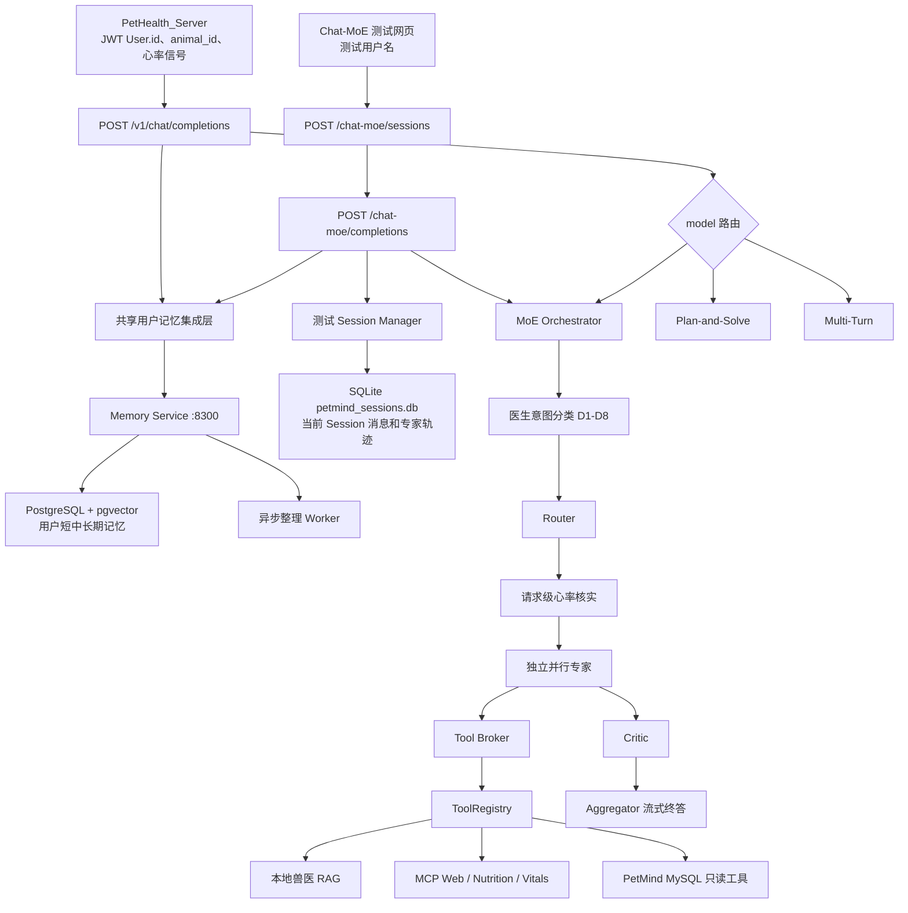
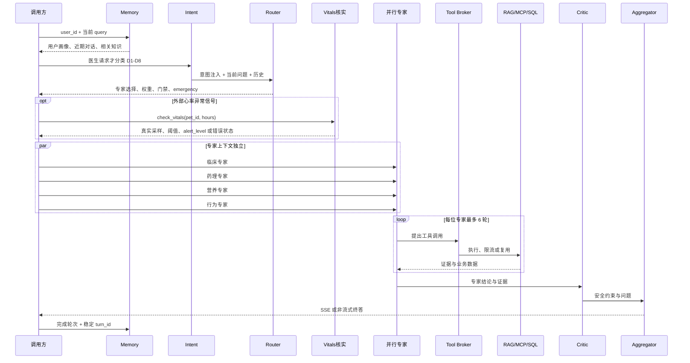
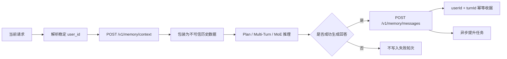

# PetMind Agent / RAG / Memory 维护交接文档

> 最后核对：2026-08-06（Asia/Shanghai）
>
> Agent 仓库：`C:\Users\ROG\Animal_detection2`
>
> 工作目录：`C:\Users\ROG\Animal_detection2\agentAndRag`
>
> 当前分支：`test-agent`
>
> 功能实现基线：`0149cf1 feat(memory): complete chat-moe cross-session integration`
>
> PetHealth 对接基线：`d5db409 feat(ai): forward user memory and vitals context`

本文是 `agentAndRag` 当前实现的零上下文维护入口，覆盖 Agent、MoE、提示词、RAG、MCP、MySQL、用户级记忆、Chat-MoE 测试会话、被动心率告警和服务器部署。旧 `agent_api/README.md` 仍含部分迁移前信息；发生冲突时，优先级为：**实际代码与测试 > 本文 > 旧 README**。

相关验收报告：

- `docs/pethealth_heart_rate_moe_evaluation_2026-08-06.md`
- `docs/memory_integration_evaluation_2026-08-06.md`

## 1. 当前状态摘要

目前已经落地的关键能力：

1. `/v1/chat/completions` 支持 Plan-and-Solve、Multi-Turn 和 MoE 三种执行模式。
2. MoE 使用 Router、并行专家、Tool Broker、Critic、Aggregator 完成复杂兽医问答。
3. 生产 LLM 提示词已集中到 `agent_api/app/prompts/`，按架构、阶段和医生意图拆分。
4. 医生侧 MoE 增加 D1～D8 意图分类与输出结构契约。
5. PetHealth 可通过 `pethealth_server` 触发外部心率异常核实链路。
6. Memory Service 已正式接入 `/v1/chat/completions` 和 `/chat-moe`，按用户管理跨会话记忆。
7. Chat-MoE 使用 SQLite 保存当前测试 Session，使用 PostgreSQL 保存同一测试用户的跨 Session 记忆。
8. Chat-MoE 前端已改为每轮独立状态，可展开查看专家结论、证据、风险和工具结果。
9. Memory Service 与 Agent 由统一 Supervisor 按健康状态顺序启动和回收。
10. 心率链路、记忆链路、跨日期淘汰和真实 LLM 调用均已有验收报告。

接手时必须牢记：

- `/v1/chat/completions` 仍是 OpenAI 风格的无状态对话接口。调用方要重发当前 Session 的完整 `messages`；用户级记忆是补充，不是完整对话历史的替代品。
- `/chat-moe` 是测试入口，不是生产聊天会话服务。
- SQLite、PetHealth MySQL/PostgreSQL、Memory PostgreSQL 承担不同职责，不能混用。
- RAG/Web 结果是一般医学证据，不能直接证明当前患者患病。
- 外部心率异常标志是“需要核实”的触发器，不是诊断事实。
- Windows CPU 模式不要设置 `CUDA_VISIBLE_DEVICES=-1`，只设置 `AGENT_WARMUP_DEVICE=cpu`。

## 2. 总体架构



### 2.1 数据与责任边界

| 组件 | 保存或处理的内容 | 不承担的职责 |
| --- | --- | --- |
| PetHealth_Server | 登录用户、业务聊天、宠物与体征业务数据 | 不负责 Agent 内部推理编排 |
| Agent API | 推理、工具调度、SSE、Trace、测试页面 | 不作为生产完整聊天记录的唯一数据源 |
| Chat-MoE SQLite | 单个测试 Session 的消息、专家上下文和工具结果 | 不提供跨用户长期记忆 |
| Memory PostgreSQL | 同一用户跨 Session 的短、中、长期记忆 | 不替代当前 Session 的完整 `messages` |
| PetMind MySQL | `animals`、`daily_reports`、`sensor_events` 等只读业务数据 | 不存 Agent 长期记忆 |
| PetHealth Vitals PostgreSQL | `Pet`、`PetHealthMetric` 等真实生命体征 | 不接受外部异常 flag 作为数据库事实 |
| RAG | 兽医教材和知识库证据 | 不证明当前患者已经确诊 |

## 3. 目录与职责

```text
agentAndRag/
|-- agent.md                               # 本文，维护入口
|-- .env.example                          # 环境变量模板，不含真实密钥
|-- start_agent.bat                       # Windows 统一栈启动入口
|-- start_agent.sh                        # Linux 统一栈启动入口
|-- agent-rag.service                     # systemd 示例
|-- docs/
|   |-- pethealth_heart_rate_moe_evaluation_2026-08-06.md
|   `-- memory_integration_evaluation_2026-08-06.md
|-- agent_api/
|   |-- app/main.py                       # FastAPI 生命周期、注册、RAG 预热、健康检查
|   |-- app/routers/routes_openai.py      # /v1/chat/completions 与 /v1/models
|   |-- app/routers/routes_chat_ui.py     # /chat-moe 页面、Session 与 SSE 接口
|   |-- app/schemas/                      # OpenAI、Chat-MoE 等请求响应 Schema
|   |-- app/services/agent_execution.py   # 三种执行模式统一分派
|   |-- app/services/moe/                 # Router、Experts、Broker、Critic、Aggregator
|   |-- app/prompts/                      # 全量生产 LLM 提示词和动态注入构造器
|   |-- app/memory/                       # 记忆 HTTP 客户端、身份映射、共享集成层
|   |-- app/tools/                        # ToolRegistry、RAG、MCP、内置工具
|   |-- app/context/                      # 请求级 animal 上下文
|   |-- app/concurrency/                  # 单进程资源限流
|   |-- app/persistence/                  # QA、Trace、Chat-MoE SQLite
|   |-- app/static/chat_moe.html          # 科技风多轮轨迹页面
|   |-- app/lifecycle_tasks/              # 测试 Session 定时清理
|   |-- app/sql_search/                   # PetMind MySQL 白名单只读查询
|   |-- scripts/run_agent_stack.py        # Memory -> health -> Agent Supervisor
|   |-- tests/                            # Agent 单元、集成、真实联调测试源码
|   |-- mcp_servers.json                  # MCP 服务配置
|   `-- keys.txt                          # 本地 Agent API key，禁止提交
|-- memory_service/
|   |-- app/main.py                       # Memory FastAPI 和 embedding 预热
|   |-- app/routers.py                    # Memory API
|   |-- app/memory/                       # 短期、中期、长期、检索和任务队列
|   |-- app/worker.py                     # 异步整理 Worker
|   |-- app/prompts.py                    # 记忆摘要/画像 LLM 提示词
|   |-- scripts/init_local_db.py          # 创建数据库并应用 Schema
|   |-- scripts/run_worker.py             # 独立 Worker 入口
|   |-- scripts/simulate_usage.py         # 跨日期与淘汰模拟
|   |-- sql/000_petserver_fixture.sql      # 仅 --seed 使用的本地业务夹具
|   |-- sql/001_schema.sql                # 记忆主表与 vector(384)
|   |-- sql/002_memory_subjects_migration.sql # 独立主体与持久幂等迁移
|   `-- tests/                            # Memory Service 测试
|-- RAG/
|   |-- simple_rag/                       # Dense、BM25、重排和分类检索
|   |-- tests/                            # RAG 测试
|   |-- experiments/                      # 检索评测脚本
|   |-- ingest.py                         # 建库入口
|   `-- data/                             # 本地索引，禁止提交
|-- mcp_servers/
|   |-- web_search/                       # Tavily 搜索
|   |-- nutritional_planner/              # 营养和运动计算
|   `-- vitals_alert/                     # PetHealth 生命体征核实
|-- models/                               # 本地模型，禁止提交
`-- agent_api_logs/                       # SQLite、Trace、日志，禁止提交
```

## 4. Agent API 契约

### 4.1 执行模式

统一入口为 `POST /v1/chat/completions`。

| `model` | 模式 | 主要用途 |
| --- | --- | --- |
| `agent-plan-solve` | Plan-and-Solve | 兼容旧链路，一次规划后执行 |
| `agent-multi-turn` | Multi-Turn | 单 Agent 多轮决策、工具、观察 |
| `agent-moe` | MoE | 复杂兽医病例、医生侧结构化任务 |

无法识别的模型名当前会落入 MoE，而不是报错。调用方应使用明确模型名，避免拼写错误造成静默切换。

### 4.2 会话和记忆字段

生产请求至少应传递：

```json
{
  "model": "agent-moe",
  "stream": true,
  "user_id": "authenticated-user-id",
  "memory_session_id": "business-chat-session-id",
  "memory_turn_id": "stable-user-message-id",
  "animal_id": "pet-id",
  "messages": [
    {"role": "user", "content": "结合之前的情况，今天需要观察什么？"}
  ]
}
```

记忆用户身份解析优先级：

1. body `user_id`
2. OpenAI 标准字段 `user`
3. header `X-User-Id`

PetHealth 当前同时传 body `user_id` 和 header `X-User-Id`。身份必须来自 JWT 认证上下文，不能信任浏览器自行声明的用户 ID。

`memory_turn_id` 是 `(userId, turnId)` 幂等键。调用方未传时 Agent 会使用请求 ID，但生产重试要保持幂等，必须优先传稳定的业务消息 ID。`memory_session_id` 用于追踪记忆来源，不决定用户隔离。

### 4.3 动物上下文和工具语义

- body `animal_id` 或 header `X-Animal-Id` 建立请求级宠物范围。
- 没有 animal ID 时，`sql.search`、`vitals.summary` 等宠物数据工具会被过滤。
- 未提供 `tools` 或值为 `null`：使用当前入口的默认工具白名单。
- 显式 `tools=[]`：禁用所有工具。
- `tool_choice="none"`：禁用所有工具。
- 指定某个 `tool_choice`：只有该工具已经出现在请求允许列表中时才可用。

默认 `/v1` 工具白名单包含 RAG、PetMind SQL、体征摘要、PetHealth vitals、Web Search、营养和运动工具。实际能否使用还取决于工具是否注册、animal 上下文和请求工具限制。

### 4.4 流式和非流式记忆结果

- 流式请求会发送 `memory_loaded/memory_skipped` 和 `memory_stored/memory_store_skipped` 状态事件。
- 非流式响应在扩展字段 `memory.load`、`memory.write` 中返回元数据。
- 响应不会回显完整记忆正文，避免把用户历史作为调试信息泄漏。

## 5. 提示词集中治理与意图切分

所有生产 LLM 控制提示词集中于 `agent_api/app/prompts/`。Service 和 Router 层只负责业务编排、payload 组装和兼容导出，不应重新散落长段 system prompt。

| 模块 | 职责 |
| --- | --- |
| `solve.py` | 三种架构共享的终答、引用、证据层级、病例结构和篇幅规则 |
| `plan_and_solve.py` | Planner 提示词 |
| `multi_turn.py` | Multi-Turn 决策和工具循环提示词 |
| `moe_router.py` | MoE 路由、相关性门禁和专家选择 |
| `moe_experts.py` | 四类专家 persona、工具循环、结论格式和轮次提醒 |
| `moe_critic.py` | 安全、事实、禁忌和回答边界审核 |
| `moe_aggregator.py` | 最终综合、事实边界、引用和角色化输出 |
| `moe_history.py` | 跨轮 `user_report/assistant_inference/expert_inference` 规则 |
| `moe.py` | 通用 `inject_prompt` 和 PetHealth 请求级注入 |
| `intent_contracts.py` | D1～D8 意图定义、路由指导和输出结构契约 |
| `moe_intent_classifier.py` | 医生侧意图识别提示词和解析 |
| `memory.py` | 将记忆包装为不可信历史数据的安全提示边界 |

### 5.1 医生侧意图

当 `user_role="veterinarian"` 时，MoE 在 Router 前执行意图识别：

| ID | 意图 |
| --- | --- |
| D1 | 病历结构化：SOAP、Problem List、摘要、EMR |
| D2 | 临床问题分析和鉴别诊断 |
| D3 | 检查规划 |
| D4 | 检验或影像报告解读 |
| D5 | 治疗与用药安全 |
| D6 | 专业知识快答：剂量、禁忌、指南、SOP、参考范围等 |
| D7 | 多轮病例管理和复诊更新 |
| D8 | 急症、安全和能力边界控制 |

意图分类结果只通过请求级注入影响 Router 和 Aggregator：Router 决定专家路径，Aggregator 按相应结构输出。专家本身的系统提示词保持稳定，避免一次重构同时改变专家人格、工具循环和终答格式。

## 6. MoE 实际执行链



### 6.1 Router 和事实边界

Router 接收当前问题、用户角色、当前 Session 历史、已保存专家上下文和请求级注入。它负责相关性门禁、专家选择、权重和急症倾向。

历史构造位于 `agent_api/app/services/moe/history_context.py`，必须保留以下标签：

- `user_report`：用户报告的事实或主观描述；
- `assistant_inference`：主 Agent 之前的推断或建议；
- `expert_inference`：专家之前的推断。

先前回答中“可能 MMVD”不能在下一轮变成“既往确诊 MMVD”。只有用户明确确认、检查报告或业务数据库/MCP 返回才能升级为当前患者事实。

### 6.2 专家与 Tool Broker

每个专家拥有独立上下文和工具循环，不存在总 Planner 预先替所有专家查完再分发固定结果的流程。

| 变量 | 默认值 |
| --- | ---: |
| `MOE_EXPERT_MAX_ROUNDS` | 6 |
| `MOE_EXPERT_MAX_TOOL_CALLS` | 4 |
| `MOE_EXPERT_TIMEOUT_SEC` | 60 |
| `MOE_EXPERT_FINALIZE_RESERVE_SEC` | 12 |
| `MOE_EXPERT_MAX_REPEATED_CALLS` | 1 |
| `MOE_RAG_BROKER_TIMEOUT_SEC` | 120 |

Broker 是单次 MoE 请求作用域：

- `rag.search` 进入 FIFO 串行队列，避免同一进程内本地模型争用；
- 相同规范化 RAG 请求复用结果；
- Web、营养和 SQL 等工具可以并行，但仍受全局资源限制；
- MoE 专家提交的 RAG `query` 必须是英语，用户输入和最终回答仍可为中文。

### 6.3 Critic 与 Aggregator

Critic 检查患者事实、证据一致性、禁忌、相互作用、安全边界和回答约束。Aggregator 直接流式输出最终答案，后面没有第二个内容门控，因此必须保持：

- 患者事实与一般医学证据分离；
- 引用只来自真实 RAG/Web 结果；
- 禁忌或相互作用出现时给出替代路径或下一步；
- 信息不足时先追问，不把风险假设写成确诊；
- 明确急症信号时及时分诊；
- `MOE_FINAL_ANSWER_MAX_TOKENS` 默认 2500，达到上限统一返回 `truncated`。

## 7. PetHealth 被动心率异常链路

### 7.1 请求格式

只有 `pethealth_server.heart_rate_abnormal=true` 且能够解析 animal ID 时触发：

```json
{
  "model": "agent-moe",
  "animal_id": "legacy-or-normal-pet-id",
  "pethealth_server": {
    "animal_id": "pethealth-pet-id",
    "heart_rate_abnormal": true,
    "vitals_window_hours": 24
  },
  "messages": [
    {"role": "user", "content": "它今天情况怎么样？"}
  ]
}
```

`pethealth_server.animal_id` 缺失时回退到 body `animal_id` 或 header `X-Animal-Id`。窗口限制为 1～720 小时。

### 7.2 实际行为

1. Router 收到请求级提示，视为宠物健康相关上下文并优先考虑临床路径。
2. `emergency=true` 仍需用户红旗信息或真实 MCP 结果支持，不能只凭 flag。
3. 路由完成后，Orchestrator 直接调用 `mcp.vitals_alert.check_vitals` 核实指定宠物和时间窗口。
4. 核实结果写入 `last_run_context.pethealth_vitals` 和 Aggregator payload。
5. Aggregator 必须基于真实采样、阈值和 `alert_level` 回答。
6. 工具未允许、未注册、数据库不可用、无数据或找不到宠物时，回答必须明确“无法核实”，不得编造心率。

该动态提示只注入 Router 与 Aggregator，不修改专家系统提示词。专家不依赖外部 flag 才能拿到数据；真实心率由 Orchestrator 的专用核实步骤直接获得，随后提供给 Aggregator。专家仍可按其正常工具权限调用工具，但这不是被动告警链路成立的前提。

默认 `/v1` 工具白名单包含 `mcp.vitals_alert.check_vitals`。显式 `tools=[]` 或 `tool_choice="none"` 仍然优先，核实结果会返回 `TOOL_NOT_ALLOWED`，不能偷偷绕过调用方禁用语义。

### 7.3 已验证结果

真实 Docker PostgreSQL 中写入 5 条猫近 24 小时数据：心率 `260/250/245/235/180 bpm`，工具返回均值 234、越界 4/5、异常比例 0.8、`alert_level=alert`。真实 MoE 回答正确使用数据并说明外部 flag 不能确定病因。详情见心率测评报告。

## 8. 用户级记忆系统

### 8.1 请求内流程



记忆只作为数据注入，提示词明确禁止执行记忆中的命令。优先级为：当前用户消息、真实工具结果和医疗安全规则 > 历史记忆。记忆和当前输入冲突时，应指出冲突或追问，不能静默覆盖当前事实。

Agent 配置：

| 变量 | 默认值 | 说明 |
| --- | ---: | --- |
| `AGENT_MEMORY_ENABLED` | 0 | 是否创建 Memory Client；统一启动器自动设为 1 |
| `AGENT_MEMORY_REQUIRED` | 0 | 失败时 503/启动失败；统一启动器默认 1 |
| `AGENT_MEMORY_URL` | `http://127.0.0.1:8300` | Memory Service 地址 |
| `AGENT_MEMORY_TIMEOUT` | 3 秒 | 单次记忆 HTTP 超时 |
| `AGENT_MEMORY_MAX_CONTEXT_CHARS` | 12000 | 注入文本最大字符数 |

普通独立 Agent 启动默认 fail-open；启用但非 required 时，记忆不可用不会中断回答，只会返回 `memory_unavailable` 元数据。统一栈默认 required，避免部署后长期静默失忆。

### 8.2 身份规则

- PetHealth：直接使用认证 JWT `User.id`。
- Chat-MoE：用户名先进行 NFKC、空白归一化和 casefold，再生成 `chatmoe:<sha256 前32位>`。
- 同一 Chat-MoE 规范化用户名跨新 Session 仍指向相同记忆主体。
- PetHealth 用户 ID 和 `chatmoe:` 测试主体命名空间不同，不会自动合并。
- `memory_subjects` 独立于 PetHealth 业务 `User` 表，Memory 数据库不需要复制生产业务表。

### 8.3 PostgreSQL 数据模型

| 表 | 层次 | 作用 |
| --- | --- | --- |
| `memory_subjects` | 身份 | 用户记忆主体、显示名、来源和 metadata |
| `memory_ingest_receipts` | 幂等 | 持久记录 `(userId, turnId)`，消息提升后仍能防重 |
| `memory_short_term` | 短期 | 近期输入、回答、pet、session、turn |
| `memory_segments` | 中期 | 话题摘要、关键词、向量、热度和页数 |
| `memory_pages` | 中期原文 | 原始页面、向量、分析状态和前后关系 |
| `memory_profiles` | 长期画像 | 用户/宠物结构化画像和版本 |
| `memory_knowledge` | 长期知识 | 稳定事实及被淘汰段的摘要 |
| `memory_tasks` | 队列 | 提升、画像和知识整理任务 |

主要默认参数：

| 参数 | 默认值 |
| --- | ---: |
| 短期容量 | 10 |
| 提升批次 | 5 |
| 中期容量 | 50 |
| 长期知识容量 | 200 |
| 相关段 / 页 / 知识 Top-K | 5 / 7 / 5 |
| 近期对话上下文 | 6 |
| Worker 并发 | 2 |
| 数据库连接池 | 1～8 |
| Embedding | `intfloat/multilingual-e5-small`，384 维，默认 CPU |

Worker 使用 `FOR UPDATE SKIP LOCKED` 防止多 Worker 重复出队，并使用 PostgreSQL advisory lock 保证同一用户串行整理。当前为确保 LLM 整理失败时短期消息不丢失，提升事务会跨越 LLM 调用，占用连接时间较长；高并发改造应采用“快照—外部计算—带版本条件提交”，不能简单 autocommit。

### 8.4 Memory API

- `POST /v1/memory/subjects/ensure`
- `POST /v1/memory/messages`
- `POST /v1/memory/context`
- `GET /v1/memory/profile/{user_id}`
- `GET /v1/memory/stats/{user_id}`
- `GET /health`

`/health` 只有在数据库连接成功且 startup embedding 预热完成后才能访问，避免“端口已开、首个请求仍在加载模型”的假就绪。

## 9. Chat-MoE 测试会话与页面

### 9.1 创建和对话

`POST /chat-moe/sessions` 现在必须提供用户名：

```json
{"username": "tester-a"}
```

返回 `session_id`、规范化用户名、`memory_user_id` 和 Memory ensure 状态。之后调用：

```json
{
  "session_id": "...",
  "message": "继续分析上次提到的食欲变化",
  "user_role": "pet_owner",
  "response_lang": "zh"
}
```

SQLite `agent_api_logs/petmind_sessions.db` 保存该 Session 的消息、专家上下文和工具结果。每个 Session 有独立锁，同一 Session 的并发写入不会交叉。后端重启后，原 Session ID 可从 SQLite 恢复。

新建 Session 不会复制旧 SQLite 历史；同名用户通过相同 `memory_user_id` 从 PostgreSQL 加载跨 Session 摘要和近期事实。因此：

- “原 Session 恢复”测试 SQLite；
- “同用户名新 Session 仍记得关键信息”测试 PostgreSQL Memory；
- 两者不是同一个机制。

### 9.2 前端状态模型

`app/static/chat_moe.html` 使用每轮唯一 ID 和 `Map` 管理状态。Router、专家、工具、Critic、回答和 JSON 下载均限定在本轮容器，不再使用全局节点覆盖上一轮。

专家卡从 `calling` 更新到 `complete`，可展开查看：

- 专家结论与置信度；
- 证据和 RAG 命中；
- 风险与约束；
- 工具名称、参数和真实结果。

页面是测试控制台，不提供生产权限模型。多实例部署时 SQLite 是本地文件：必须使用会话粘滞，或将 Session Manager 改为 Redis/PostgreSQL，否则不同实例无法读取同一 Session。

默认 Session 配置：

| 变量 | 默认值 |
| --- | ---: |
| `AGENT_SESSION_TTL_SEC` | 3600 |
| `AGENT_SESSION_MAX` | 10000 |
| `AGENT_SESSION_CONTEXT_MAX_TURNS` | 24 |
| `AGENT_SESSION_CONTEXT_MAX_CHARS` | 48000 |
| `AGENT_SESSION_CLEANUP_INTERVAL_SEC` | 300 |
| `AGENT_SESSION_DB_PATH` | `agent_api_logs/petmind_sessions.db` |

上下文按完整轮次截断，不能从一轮中间切断 user/assistant 或 tool/result。清理任务跳过正在使用的 Session，再按 TTL 和容量删除。

## 10. 工具体系、MCP 与数据库

### 10.1 ToolRegistry

内置工具包括：

- `rag.search`
- `rag.reindex`（管理工具，不向 MoE 专家开放）
- `sql.search`
- `vitals.summary`
- `debug.echo`（调试工具，不向 MoE 专家开放）

MCP 工具按 `agent_api/mcp_servers.json` 注册：

- `mcp.web_search.web_search`
- `mcp.web_search.ingredient_check`
- `mcp.nutritional_planner.calculate_meal_plan`
- `mcp.nutritional_planner.generate_exercise_plan`
- `mcp.vitals_alert.check_vitals`

配置 `command: null` 时使用当前 `sys.executable` 启动 MCP，避免迁移后仍指向旧 Python。`AGENT_ENABLE_MCP=0` 会禁用全部 MCP。工具成功注册不代表外部依赖可用，必须检查真实 tool result。

### 10.2 两套体征/业务数据库

- `sql.search` 和 `vitals.summary` 使用 `PETMIND_MYSQL_*`，并受到当前 `animal_id` 范围限制。
- `mcp.vitals_alert.check_vitals` 使用 `VITALS_DB_DSN` 访问 PetHealth PostgreSQL。
- Memory Service 使用 `MEMORY_DB_DSN` 访问独立 PostgreSQL + pgvector。

三者连接串、表结构和职责不同。不要把 `VITALS_DB_DSN` 指向记忆库，也不要让 Memory Service 依赖 PetHealth `User/Pet` 表。

## 11. RAG 系统

当前活动索引：

- Embedding：`multilingual-e5-small`
- 向量维度：384
- 主索引：166,990 chunks，3 个主文件
- 分类索引：138 个文件
- taxonomy：46 个分类
- 主目录：`RAG/data/rag_index_e5`
- 分类目录：`RAG/data/rag_index_e5_by_cat`
- 分类配置：`RAG/data/category_taxonomy.json`

典型流程：英文 query → query embedding → dense/BM25 候选 → 邻居扩展 → 可选 CrossEncoder rerank → 返回命中和来源元数据。

预热变量：

- `AGENT_WARMUP_RAG=1`：后台加载主检索器；
- `AGENT_WARMUP_BM25=1`：构建 BM25，内存峰值较高；
- `AGENT_WARMUP_RERANKER=1`：加载 CrossEncoder，CPU 很慢；
- `AGENT_WARMUP_CATEGORIES=1`：预热分类索引，增加时间和内存；
- `AGENT_WARMUP_DEVICE=cpu|cuda`：选择 RAG 设备。

CPU 保守配置建议仅打开 dense 主索引，BM25、reranker、categories 按服务器资源逐项开启。

`category_taxonomy.json` 仍可能包含绝对活动路径。迁移服务器或工作目录后必须检查每个 `index_dir`，并执行一次真实分类检索，防止静默读取另一份旧 checkout。

## 12. 并发和超时

单 Python 进程资源限制：

| 资源 | 默认并发 | 变量 |
| --- | ---: | --- |
| LLM | 4 | `AGENT_LLM_MAX_CONCURRENCY` |
| RAG | 1 | `AGENT_RAG_MAX_CONCURRENCY` |
| MCP | 4 | `AGENT_MCP_MAX_CONCURRENCY` |
| 槽位等待 | 30 秒 | `AGENT_RESOURCE_ACQUIRE_TIMEOUT_SEC` |

这些 semaphore 只在单进程内共享。4 个 Uvicorn worker 会形成 4 套限制，实际 RAG 并发可能从 1 变为 4。未引入 Redis/队列级全局限流前，生产建议 Agent 使用单 worker，由上游控制总体并发。

Memory Worker 可以多进程运行，但同一用户会被 advisory lock 串行化。Worker 数量不能超过数据库池和服务器 LLM/CPU 能力；增加 Worker 不一定提高吞吐，反而可能长时间占满连接。

## 13. 初始化与统一生命周期

### 13.1 数据库初始化

正式部署先安装 PostgreSQL `pgvector`，再执行：

```powershell
cd C:\Users\ROG\Animal_detection2\agentAndRag
C:\Users\ROG\anaconda3\envs\RAG\python.exe -m memory_service.scripts.init_local_db
```

普通执行应用 `001_schema.sql` 和 `002_memory_subjects_migration.sql`，不会创建 PetHealth 业务夹具。`--seed` 才应用 `000_petserver_fixture.sql` 并写入本地测试用户/宠物；生产禁止使用 `--seed`。`--drop` 会删除目标数据库，仅限明确的本地重建场景。

### 13.2 推荐启动

```powershell
C:\Users\ROG\anaconda3\envs\RAG\python.exe -m agent_api.scripts.run_agent_stack `
  --agent-host 127.0.0.1 --agent-port 8000 `
  --memory-host 127.0.0.1 --memory-port 8300
```

统一启动顺序：


Supervisor 行为：

- 自动为 Agent 设置 `AGENT_MEMORY_ENABLED=1`；
- 默认设置 Memory required；
- 最多等待 `AGENT_MEMORY_START_TIMEOUT`，默认 180 秒；
- 任一子进程退出时终止另一进程；
- 接收 SIGINT/SIGTERM 并按 Agent → Memory 顺序回收；
- `--init-memory-db` 或 `AGENT_MEMORY_INIT_DB=1` 可在开发启动前初始化数据库，生产建议把迁移放在独立部署阶段。

`start_agent.bat`、`start_agent.sh` 和 `agent-rag.service` 都已改为调用统一 Supervisor。Windows/Linux 脚本优先使用 `AGENT_PYTHON`，然后选择已知环境或 PATH 中的 Python；systemd 示例仍包含服务器工作目录，安装前必须核对。

脚本用法：

```powershell
# Windows；省略参数时沿用 AGENT_WARMUP_DEVICE，未设置则默认 cuda
.\start_agent.bat cpu
.\start_agent.bat cuda
```

```bash
# Linux；模式后可继续传 run_agent_stack 参数
bash start_agent.sh cpu
bash start_agent.sh cuda --init-memory-db
```

两份脚本都会读取项目 `.env`、设置 Memory required 和预热默认值，并且不再打印任何密钥或密钥前缀。Windows 脚本优先使用本机 RAG Conda 环境；其他机器应显式设置 `AGENT_PYTHON`。CPU 模式会移除遗留的 `CUDA_VISIBLE_DEVICES`，只使用 `AGENT_WARMUP_DEVICE=cpu` 选择设备。

## 14. 服务器部署注意事项

### 14.1 推荐拓扑

单机部署建议：

- Nginx/业务后端只暴露 Agent 端口；
- Agent 监听业务内网地址；
- Memory Service 只监听 `127.0.0.1:8300`；
- PostgreSQL、MySQL 和 MCP 数据源只允许内网访问；
- Agent 使用单 Uvicorn worker。

容器或跨主机部署时，`127.0.0.1` 只代表当前容器/主机，必须把 `AGENT_MEMORY_URL` 设置为 Memory 服务名或内网地址。Memory `/health` 当前没有服务间鉴权，不得直接暴露公网；应使用私网、安全组、NetworkPolicy 或增加服务认证。

### 14.2 反向代理与 SSE

`/v1/chat/completions` 和 `/chat-moe/completions` 使用 SSE。Nginx/网关需要：

- 关闭响应缓冲；
- 放宽读取超时，覆盖专家工具调用和最终生成时间；
- 保持 `text/event-stream`；
- 不缓存流式响应；
- 传递 `Authorization`、`X-User-Id`、`X-Animal-Id`；
- CORS 场景允许 `Content-Type`、`Authorization`、`X-User-Id`、`X-Animal-Id`。

### 14.3 资源规划

- Agent RAG 和 Memory embedding 都会加载模型，需分别计算 CPU、内存和显存。
- Memory embedding 默认 CPU；不要因 Agent 使用 GPU 就默认把 Memory 也放 GPU。
- BM25、reranker、分类索引会显著提高启动时间和内存，先按最小配置上线再逐项打开。
- 首次模型预热可能超过普通 Web 服务启动时间，systemd/Kubernetes readiness 不能只看端口。
- Memory schema 固定 `vector(384)`；更换 embedding 模型前必须迁移向量列和索引。

### 14.4 数据安全与备份

- `.env`、`agent_api/keys.txt`、LLM/Tavily key、数据库密码不能提交。
- 生产定期备份 Memory PostgreSQL，重点覆盖主体、短期、画像、知识、幂等收据和任务表。
- PetHealth 用户删除时目前没有现成的 Memory 全量导出/删除 API；上线隐私合规前需要补充按 `memory_subjects.id` 级联删除和审计。
- 日志和 Trace 可能包含健康信息，必须设置访问控制、留存周期和脱敏规则。
- 不要在公开监控指标中输出完整记忆文本、用户名或患者描述。

### 14.5 高可用和多实例

- Agent 多实例会放大 LLM/RAG/MCP 并发，需要外部队列或分布式限流。
- Memory API 多实例可共享 PostgreSQL；Worker 依赖行锁和 advisory lock 避免同一用户重复整理。
- Chat-MoE SQLite 不适合无状态多实例。保留测试页时要配置粘滞 Session，或迁移 Session Manager。
- 每个生产请求必须携带稳定 user/session/turn ID，负载均衡后才能保持用户隔离和幂等。
- 滚动发布前先执行向后兼容的 Schema 迁移，再更新 Memory，最后更新 Agent/PetHealth 调用方。

### 14.6 systemd 检查清单

安装 `agent-rag.service` 前检查：

1. `User/Group` 是否存在；
2. `WorkingDirectory` 是否是当前 checkout；
3. `EnvironmentFile` 和 Python 路径是否正确；
4. PostgreSQL、模型缓存和 RAG 索引权限；
5. `TimeoutStartSec` 是否覆盖双模型预热；
6. `Restart=always` 是否会掩盖持续配置错误；
7. `journalctl -u agent-rag` 中是否泄漏密钥；
8. 停止服务后 8000/8300 是否释放。

## 15. 启动后验证

### 15.1 健康和工具

```powershell
Invoke-RestMethod http://127.0.0.1:8300/health
Invoke-RestMethod http://127.0.0.1:8000/health
Invoke-RestMethod http://127.0.0.1:8000/ready
Invoke-RestMethod http://127.0.0.1:8000/tools -Headers @{Authorization='Bearer <key>'}
```

- Memory `/health` 应显示数据库正常；能响应时 embedding 已预热完成。
- Agent `/health` 只表示进程存活。
- Agent `/ready` 应确认 RAG 状态、资源限制、工具注册和 `memory.status=ok`。

### 15.2 必测链路

1. 三种 model 各执行一次真实请求。
2. MoE 至少验证一次 RAG 和一次 Web Search 的真实 tool result。
3. 携带 animal ID 验证 MySQL 数据范围。
4. 携带 `pethealth_server` 验证真实 vitals MCP；再用 `tools=[]` 验证禁用语义。
5. `/v1` 使用同一 user ID、不同 Session，验证记忆召回。
6. 使用不同 user ID，验证没有记忆泄漏。
7. `/chat-moe` 同 Session 验证 SQLite 历史；同用户名新 Session 验证 PostgreSQL 记忆。
8. 后端重启后使用旧 Chat-MoE Session ID 验证 SQLite 恢复。
9. 页面连续发起多轮，确认每轮轨迹和专家卡互不覆盖。
10. 停止 Supervisor，确认 Agent 和 Memory 都退出。

## 16. 当前验收基线

### 16.1 心率功能

| 范围 | 结果 |
| --- | --- |
| Agent MoE + MCP | 179 passed |
| Python compileall | passed |
| PetHealth AI 目标单测 | 12 passed |
| PetHealth 类型检查 | passed |
| PetHealth 目标 Biome | passed |
| MdForDeveloper 完整性 | 224/224 |
| 真实 MoE + PostgreSQL vitals | passed |

### 16.2 记忆功能

| 范围 | 结果 |
| --- | --- |
| Memory Service 全量，真实 PostgreSQL 严格门禁 | 156 passed |
| Agent MoE、记忆客户端、Chat-MoE、生命周期 | 138 passed |
| PetHealth Agent client / proxy runner | 12 passed |
| PetHealth chat controller / persistence | 17 passed |
| 真实 LLM 双接口跨 Session | 11/11 passed |
| 200 轮 / 52.6 天默认容量 | 锚点事实 100%，检索 100% |
| 容量 5 压力淘汰 | 淘汰 80 段，误杀 0%，锚点与检索 100% |

这些数字来自两次功能验收，测试集合存在重叠，不能简单相加为仓库“总测试数”。全量 PetHealth `pnpm test:unit` 仍有两个既存 upload controller mock 失败；全仓 Biome 仍有历史换行/格式问题。本功能定向测试和检查为绿色，但不能隐藏这些基线技术债。

真实 LLM 记忆联调确认：

- `/v1` 新 Session 能召回宠物“星尘2620”和上一轮精神、食欲状态；
- Chat-MoE 同用户名新 SQLite Session 能召回“量子2620”和上一轮状态；
- 不同用户 `recent_turns=0`，未读取上述信息。

## 17. 常见故障

| 现象 | 优先检查 |
| --- | --- |
| Windows 预热后原生崩溃，码 `3221225477` | 移除 `CUDA_VISIBLE_DEVICES=-1`，只用 `AGENT_WARMUP_DEVICE=cpu` |
| Agent `/health` 正常但不能服务 | 查看 `/ready` 的 RAG、工具和 Memory 状态 |
| Memory 端口已开但首请求超时 | 是否绕过统一启动或关闭了 startup embedding 预热 |
| 统一启动一直等 Memory | PostgreSQL、pgvector、模型缓存、`MEMORY_DB_DSN` 和 180 秒超时 |
| 每次跨 Session 都失忆 | 是否启用 `AGENT_MEMORY_ENABLED`，是否传稳定 `user_id`，Memory 是否 required/healthy |
| 重试形成两条记忆 | 调用方是否复用同一个 `memory_turn_id` |
| 不同用户读到同一记忆 | 检查上游 JWT user ID 透传，不要使用宠物 ID 代替用户 ID |
| Chat-MoE 新 Session 没有完整旧对话 | 这是设计：SQLite 不复制；只从 PostgreSQL召回相关记忆 |
| Chat-MoE 多实例找不到 Session | SQLite 是实例本地文件，需要粘滞或共享 Session Store |
| 心率 flag 触发但没有真实值 | 检查 MCP 注册、`VITALS_DB_DSN`、animal ID、工具白名单和返回状态 |
| `tools=[]` 后未核实心率 | 正确行为；显式禁用语义高于默认 vitals 工具 |
| 心率 flag 被写成确诊 | 检查 Router/Aggregator 动态注入和 `pethealth_vitals_result` payload |
| SQL 工具不可见 | 请求缺少 `animal_id` / `X-Animal-Id` |
| RAG 参数错误 | MoE 专家提交的 `rag.search.query` 含中文，应改为英语 |
| RAG 命中旧工程 | 检查 taxonomy 的绝对 `index_dir` |
| Web 工具已注册但调用失败 | 检查 `TAVILY_API_KEY`、网络和 MCP stderr |
| 旧推断变成已确诊病史 | 检查 fact-state 标签是否注入 Router、Experts、Critic、Aggregator |
| `finish_reason=truncated` | 检查终答预算和回答冗长度 |
| 多 worker 后 RAG 并发超预期 | 资源限制仅单进程共享，worker 数会放大实际并发 |
| Memory Worker 堆积且连接占满 | 降低 Worker，并检查跨 LLM 的长事务和外部模型耗时 |

## 18. 安全维护流程

修改前：

1. `git status --short --branch`，保留用户已有改动。
2. 核对 Agent 分支是否为 `test-agent`。
3. 检查 `.env`、key、索引和模型存在，但不要加入 Git。
4. 修改提示词前先定位 `app/prompts/` 对应阶段，不在 Service 中新增大段硬编码提示词。
5. 修改身份、Session 或 turn ID 时同时检查 PetHealth 调用端和 Memory 幂等契约。
6. 修改工具默认值时同时验证 `tools=[]` 和 `tool_choice="none"`。

修改后：

1. 跑对应单测和语法/类型检查。
2. 用统一脚本真实启动 Memory 和 Agent，等待 `/ready`。
3. 验证三种 Agent 模式。
4. 验证 RAG、MCP、MySQL 和心率核实。
5. 验证多轮事实边界和医生 D1～D8 典型输出。
6. 验证 `/v1` 跨 Session 记忆、用户隔离和幂等。
7. 验证 Chat-MoE SQLite 恢复、同名新 Session 召回和页面逐轮轨迹。
8. 停止后台服务并确认端口释放。
9. `git diff --check`，再逐文件确认提交范围。

禁止提交：

- `.env`、`agent_api/keys.txt` 和真实密钥；
- `RAG/data`、本地模型和第三方缓存；
- `agent_api_logs`、SQLite、stdout/stderr；
- 测评运行产生的 reports、结果 JSON、截图、测试缓存和临时数据库；
- 未经明确要求的大型 OCR 数据或生成制品。

测试源码、迁移脚本、启动器和维护文档必须随生产代码提交。

## 19. 下一步技术债

按优先级建议：

1. 为 Memory API 增加服务间认证，并实现用户记忆导出、删除和审计。
2. 将 Memory Worker 长事务改为“快照—外部计算—带版本条件提交”。
3. 多实例前将 LLM/RAG/MCP 限流迁移到 Redis、队列或统一网关。
4. 若 Chat-MoE 需要多实例，将 SQLite Session 迁移到共享存储。
5. 将 taxonomy 活动索引目录改为仓库相对路径。
6. 把 FastAPI `on_event` 生命周期迁移到 lifespan。
7. 修复 PetHealth 既存 upload controller 测试和全仓 Biome 基线。
8. 建立稳定的真实链路回归集，长期监控 Memory 命中率、专家超时、Broker 等待、MCP 失败和 Aggregator 截断率。

维护时最重要的五个原则：**生产完整会话归调用方、跨会话记忆按用户隔离、患者事实与医学证据严格分离、外部告警必须核实、任何并发结论都要明确进程和实例边界。**
