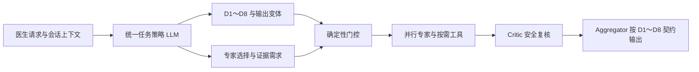

# D1–D8 统一任务策略测评报告

> 本文件取代旧的“独立意图分类器 + Router”报告。当前生产链路只保留一次统一任务策略决策。

## 结论

2026-08-16 使用真实 DeepSeek API 完成 24 个混合边界病例（D1～D8 各 3 题）全链路回归：24/24 分类正确，24/24 输出结构符合对应意图契约，需要检索的病例均完成指定 RAG 或 Web Search，不需要检索的病例没有被强制调用工具。

## 当前链路

- 分类边界与八个领域的 `routing_guidance` 位于 `agent_api/app/prompts/intent_contracts.py`。
- 单次决策提示词位于 `agent_api/app/prompts/moe_task_policy.py`。
- 确定性门控只校验策略结果，不再进行关键词分类或额外 Router LLM 调用。
- 显式要求查询最新资料、核实来源或提供引用时必须检索；常规病例可按策略按需检索，不锁死专家工具调用。
- Critic 可以限制危险内容，但不能绕过 D1～D8 输出契约。

## 真实回归范围

| 维度 | 重点边界 | 题数 | 分类与格式 | 检索行为 |
| --- | --- | ---: | ---: | ---: |
| D1 | 病历摘要、SOAP、Problem List | 3 | 3/3 | 3/3 |
| D2 | 鉴别诊断、证据支持与反对 | 3 | 3/3 | 3/3 |
| D3 | 检查优先级、目的和结果分支 | 3 | 3/3 | 3/3 |
| D4 | 化验、影像与监测结果解释 | 3 | 3/3 | 3/3 |
| D5 | 治疗、剂量核对与用药安全 | 3 | 3/3 | 3/3 |
| D6 | 指南、概念、SOP 与参考资料 | 3 | 3/3 | 3/3 |
| D7 | 基于历史的复诊和动态管理 | 3 | 3/3 | 3/3 |
| D8 | 急症、拒答和能力边界 | 3 | 3/3 | 3/3 |
| **合计** |  | **24** | **24/24** | **24/24** |

完整结果保存在忽略提交的运行目录 `agent_api/tests/moe/reports/unified_policy_regression_full_final_20260816/`；可复现脚本为 `agent_api/tests/moe/run_unified_policy_regression_live.py`。
