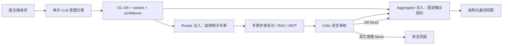

# D1–D8 医生端意图分类与 MoE 输出契约测评报告

## 1. 测评结论

本次改造以《小动物 agent 评估维度和指标 3.0》中的 D1–D8 为唯一能力分类标准，已将原先基于正则表达式的“具体病例”判断替换为一次独立 LLM 分类，并将分类结果同时注入 MoE Router 与 Aggregator。

真实后端最终采集 32 个问题（每类 4 题）的完整 SSE 与 LLM 终答：意图分类 32/32 正确，输出契约校验 32/32 通过；4 并发下 LLM、RAG、MCP 均无资源拒绝。

## 2. 实现链路

关键行为：

- 医生端每个请求只增加一次意图分类 LLM 调用；宠主端不增加该调用。
- 分类器严格输出 `primary_intent`、`confidence`、`output_variant`、`reason`，解析失败安全回退 D2。
- D1 支持 SOAP、Problem List、病例摘要、EMR；D6 支持剂量、禁忌、相互作用、指南、SOP、参考范围、概念、预后、物种差异知识卡。
- 意图状态保存在请求级 Orchestrator 实例中，8 路并发单测证明不同请求不会串扰。
- D8 的 Critic `block` 表示阻止危险内容，但仍由 Aggregator 生成完整安全响应；其它意图继续沿用硬阻断兜底。
- Critic 内容只作为安全约束，不作为医学事实来源；无检索证据时 D8 不得补充精确剂量或数值阈值。

## 3. D1–D8 覆盖结果

| 维度 | 能力 | 真实题数 | 分类 | 输出契约 |
| --- | --- | ---: | ---: | ---: |
| D1 | 病历结构化 | 4 | 4/4 | 4/4 |
| D2 | 临床问题分析 | 4 | 4/4 | 4/4 |
| D3 | 检查规划 | 4 | 4/4 | 4/4 |
| D4 | 报告解读 | 4 | 4/4 | 4/4 |
| D5 | 治疗与用药安全 | 4 | 4/4 | 4/4 |
| D6 | 专业知识快答 | 4 | 4/4 | 4/4 |
| D7 | 多轮病例管理 | 4 | 4/4 | 4/4 |
| D8 | 安全与边界控制 | 4 | 4/4 | 4/4 |
| **合计** |  | **32** | **32/32** | **32/32** |

全量运行耗时 294.62 秒；后端资源终态如下：

| 资源 | 并发上限 | acquired | rejected | 最终 active/waiting |
| --- | ---: | ---: | ---: | ---: |
| LLM | 4 | 232 | 0 | 0/0 |
| RAG | 1 | 29 | 0 | 0/0 |
| MCP | 4 | 33 | 0 | 0/0 |

注：首次生成的自动摘要显示 28/32，四项均经原始答复审计确认为等价表达误报（如“血尿/尿血”“禁止/不能”）。修正语义等价规则后，对同一批不可变原始终答重新校验为 32/32，没有替换或改写模型回答。旧报告与验证后报告均保留，便于审计规则变化。

## 4. 回归测试

| 范围 | 命令/方式 | 结果 |
| --- | --- | --- |
| Agent 全量 Python 测试 | `python -m pytest agent_api/tests -q` | 229 passed，4 个 FastAPI lifespan 弃用警告 |
| MoE 意图与并发 | 分类器、注入、D8 block、8 路隔离 | 全部通过 |
| 真实 Agent HTTP/SSE | 32 题、4 并发、默认工具链 | 32/32 通过 |
| PetHealth 客户端目标测试 | `pnpm exec vitest run tests/unit/ai/agent-service.client.test.ts` | 8/8 通过 |
| PetHealth 全单元脚本 | `pnpm test:unit ...` | 365/367；2 个既有 upload controller 测试失败，与本功能无关 |

PetHealth 两个既有失败均位于 `upload.controller.test.ts`，原因是测试桩返回的 `metadataList` 含 `undefined`，业务代码读取 `metadata.filename` 时抛错；`agent-service.client.test.ts` 单独运行全部通过。

## 5. 提示词集中管理审计

LLM 系统提示词已集中到 `agent_api/app/prompts/`：

- `intent_contracts.py`：D1–D8 单一事实源、路由建议、输出契约和变体；
- `moe_intent_classifier.py`：分类器提示词与 JSON 输出约束；
- `moe_router.py`、`moe_aggregator.py`：Router/Aggregator；
- `moe_experts.py`、`moe_critic.py`、`moe_history.py`：专家、审核与历史事实；
- `plan_and_solve.py`、`solve.py`、`multi_turn.py`：规划、求解、多轮决策。

对 `agent_api/app` 的中文系统指令与 prompt 常量做了反向搜索，服务层仅保留 prompt builder 调用、业务 payload 与运行状态，不再保存完整硬编码提示词。

## 6. 原始证据

- `reports/intent_eval_final_20260806/results.json`：32 题原始 SSE、分类事件与模型终答。
- `reports/intent_eval_final_20260806/summary.md`：修正规则前自动报告（28/32，保留作审计）。
- `reports/intent_eval_verified_20260806/results.json`：同一批原始终答的当前规则校验结果。
- `reports/intent_eval_verified_20260806/summary.md`：最终 32/32 报告及全部真实 LLM 回复。
