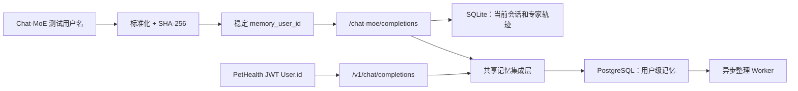

# 用户级记忆系统接入与联调测评报告

## 结论

本次完成 Memory Service、Agent `/v1/chat/completions`、Chat-MoE 和 PetHealth 调用链的用户级记忆接入。SQLite 负责保存单个 Chat-MoE 测试会话的消息与专家轨迹，PostgreSQL + pgvector 负责同一用户跨会话、跨日期的短期、中期和长期记忆。

真实 LLM 双接口联调共 11 项，全部通过：两个接口均能在新 session 中召回宠物名称与上次健康状态，不同用户之间未出现记忆泄漏。

## 问题、处理与结果

| 现象 | 处理 | 结果 |
| --- | --- | --- |
| Memory Service 与 Agent 解耦 | 增加共享异步客户端，在推理前读取、成功回答后写入 | `/v1` 与 Chat-MoE 共享同一套用户记忆能力 |
| Chat-MoE 新建会话后历史上下文丢失 | 用户名标准化并映射为稳定记忆主体；SQLite 与 PostgreSQL 分工存储 | 同一用户名跨 session 可召回，不同用户隔离 |
| 页面新一轮覆盖上一轮思考轨迹 | 每轮使用独立 DOM、状态 Map 和唯一 turn ID | 多轮路由、专家、工具和回答均可独立回看 |
| PetHealth 未传认证用户身份 | 将 JWT `User.id` 透传为 `user_id`、`X-User-Id`，同时传 session/turn 幂等键 | 生产入口按真实用户归属记忆 |
| 请求重试可能重复写入 | 增加持久化 receipt，使用 `(userId, turnId)` 幂等 | 同一轮重试不会重复形成记忆 |
| 首次请求才加载 embedding，required 模式可能超时 | Memory 服务启动阶段预热模型，健康后再启动 Agent | 首轮请求可直接使用记忆能力 |
| 默认容量未触发淘汰，无法验证关键事实保护 | 增加容量 5 的 200 轮压力模拟 | 淘汰 80 个段，关键事实存续和检索均为 100% |

## 真实 LLM 联调

### `/v1/chat/completions`

- 用户：`live-v1-26206c34`
- 第一 session：`v1-session-a-26206c34`
- 第二 session：`v1-session-b-26206c34`
- 第二轮加载：`recent_turns=1`，`context_chars=392`

第二 session 的真实回复节选：

> 星尘2620，你好呀！新的一天，咱们继续来关注这位小可爱的健康状况～上次你提到它精神和食欲都正常……今天可以重点观察喝水与排尿、体重与体态。

### `/chat-moe`

- 用户名：`live tester 26206c34`
- 记忆主体：`chatmoe:e9729bbecc81d60d0f9970d4170b9591`
- 两个独立 SQLite session：`1125f972ff9247e7a4a24be0363fac22`、`ba248dfed3084fe38ddc542062aabaab`
- 第二轮加载：`recent_turns=1`，`context_chars=225`

第二 session 的真实回复节选：

> 好的，量子2620！很高兴继续我们的健康随访。上次你饮食和精神都正常……今天给你两个日常观察点：喝水与排尿、大便性状与次数。

使用另一个用户名请求时，`memory_context_loaded.recent_turns=0`，没有读到上述名称和状态。

## 数据结构与存储边界

| 层次 | 表 | 作用 |
| --- | --- | --- |
| 身份 | `memory_subjects` | 独立维护记忆主体，不依赖 PetHealth 业务用户表 |
| 幂等 | `memory_ingest_receipts` | 记录用户和 turn ID，避免重试重复写入 |
| 短期 | `memory_short_term` | 保存近期用户输入、回答、session 和 turn |
| 中期 | `memory_segments`、`memory_pages` | 保存摘要、关键词、向量、热度和原文页 |
| 长期 | `memory_profiles`、`memory_knowledge` | 保存用户画像、稳定事实和淘汰摘要 |
| 队列 | `memory_tasks` | 驱动异步提升、画像更新和知识整理 |

Chat-MoE 的 SQLite `agent_sessions` 只保存当前 session 的消息和 `expert_context`；不同 session 不复制对话历史。共享记忆通过相同 `memory_user_id` 从 PostgreSQL 读取，因此不会破坏原有 Chat-MoE 会话并发与 session 隔离机制。

## 跨日期与淘汰测评

| 场景 | 轮数/虚拟时间 | 淘汰 | 锚点事实存续 | 检索命中 |
| --- | --- | --- | --- | --- |
| 默认容量 50 | 200 轮 / 52.6 天 | 未达到容量，不淘汰 | 100% | 100% |
| 压力容量 5 | 200 轮 / 52.6 天 | 80 个段，误杀率 0% | 100% | 100% |

压力运行将淘汰摘要沉淀为 14 条 `evicted_segment` 长期知识，证明容量受限时仍能保护关键事实。

## 自动化测试结果

| 范围 | 结果 |
| --- | --- |
| Memory Service 全量，真实 PostgreSQL 严格门禁 | 156 passed |
| Agent MoE、记忆客户端、Chat-MoE、生命周期 | 138 passed |
| PetHealth Agent client / proxy runner | 12 passed |
| PetHealth chat controller / persistence | 17 passed |
| PetHealth TypeScript | `pnpm check:types` passed |
| PetHealth 本次修改文件 Biome | passed |
| MdForDeveloper 完整性 | 224/224，missing 0，extra 0 |
| 真实 LLM 双接口跨 session | 11/11 passed |

全量 `pnpm test:unit` 另有两个既存 upload controller mock 失败，与本次 AI/记忆改动无关；全仓 Biome 也存在历史换行和格式诊断，本次修改文件的定向检查为绿色。

## 生命周期与保留约束

统一启动器按“应用 schema → 启动 Memory → 预热 embedding → 检查 Memory 健康 → 启动 Agent”的顺序运行，任一子进程退出时会回收另一个进程。

- Worker 当前在提升事务内执行 LLM，以保证 LLM 失败时短期对话不丢失；后续高并发版本可改为“快照—外部计算—带版本条件提交”。
- Memory API 目前按内部 loopback 服务设计；远程部署需要私网隔离或服务间认证。
- 尚未提供用户自助导出或删除全部记忆的接口，生产隐私合规阶段需补充级联删除和审计。
