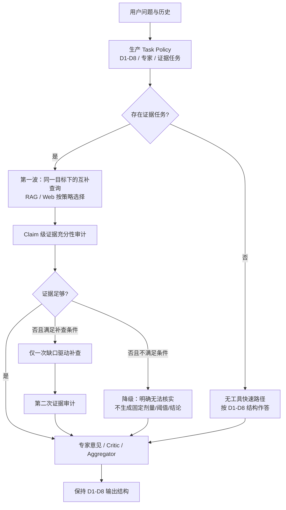

# PetMind MoE 证据检索架构对照评测报告

日期：2026-08-21
范围：证据检索、证据充分性判断、D1–D8 意图与输出结构守恒
结论性质：评测与架构建议；本轮未修改生产 MoE 执行代码

## 1. 结论摘要

本轮没有证据支持立即把生产链路整体替换成“所有问题默认多查询、证据不足再补一轮”的方案。

真实 DeepSeek 24 题、A/B/C 共 72 次运行显示：

| 架构 | D1–D8 意图通过率 | 输出结构通过率 | 终答准确率 | 语义支持率 | Token | 平均耗时 |
| --- | ---: | ---: | ---: | ---: | ---: | ---: |
| A：当前生产 MoE | 100% | 100% | 98.1% | 34.7% | 499,517 | 29.87 s |
| B：批量多查询 + 一次证据分析 | 100% | 100% | 94.4% | 29.2% | 438,478 | 25.62 s |
| C：B + 一次缺口补证 | 100% | 100% | 96.7% | 31.9% | 540,099 | 27.77 s |

核心判断：

1. **D1–D8、专家选择和输出格式没有被实验链路破坏。** 三种模式都先调用现有 Task Policy，实验规划器只能细化已有证据任务，不能重分类、改写专家路由或替换输出模板。
2. **B 更省 Token、略快，但整体答复质量下降。** 它可作为后续优化方向，不能直接替换生产专家、Critic 和 Aggregator。
3. **C 没有证明“默认第二轮检索”值得启用。** 相比 B，24 题仅 1 题证据得分提高、1 题下降，11 题触发补证；总 Token 反而最高。
4. **第二轮的主要收益来自更保守的重写，而不是检索到更多可靠证据。** 应把“证据不足时收缩结论”作为稳定能力，把补查限制为有明确缺口且存在更优来源的少数问题。
5. **面向近期正式评测，建议继续使用 A。** 下一阶段只先接入无工具快速路径、claim 级证据审计和选择性单次补查，不删除现有专家、Critic、Aggregator，也不改变 D1–D8 提示词注入。

## 2. 被严格保留的生产约束

### 2.1 D1–D8 与提示词注入

实验 B/C 不是新的意图分类器，而是复用生产 `decide_task_policy` 的输出：

- `actual_intent`：D1–D8；
- `output_variant`：对应意图的输出变体；
- `selected_experts`：专家路由；
- `evidence_tasks`：是否检索、检索目标及工具类型；
- 急症、用户身份、PetHealth 心率异常、历史事实标签等现有上下文注入。

Task Policy 返回后，以上字段被冻结。后续查询规划器只允许：

- 为已有 `evidence_task` 生成一到两个互补查询；
- 标记证据目标为 `supported / partial / conflicting / unsupported`；
- 针对同一 `goal_id` 描述缺口并改写一次查询。

它不允许新增意图、修改 D1–D8、替换专家、降低急症等级或自行创建没有来源的必检任务。

### 2.2 输出结构

B/C 终答复用现有 `intent_output_contract` 和 `intent_required_sections`。24 个自然混合问题中，A/B/C 的意图和结构通过率均为 100%。这说明把证据分析插入 Task Policy 之后，不会天然破坏导师关注的 D1–D8 输出范式。

但 B/C 为隔离实验，未运行生产专家、Critic、Aggregator。因此本报告不能把 B/C 与 A 的终答差异全部归因于检索策略。

## 3. 对照架构

| 模式 | 用途 | 执行方式 |
| --- | --- | --- |
| A | 生产基线 | 现有 Task Policy、专家、工具循环、Critic、Aggregator |
| B | 验证“一波多查询 + 证据审计” | 冻结 Task Policy；多查询；一次证据分析；按 D1–D8 契约合成 |
| C | 验证“有界补证” | B 的基础上最多再改写、检索和分析一次 |

## 4. 评测设计

### 4.1 三层证据

1. **100 题受控来源恢复集**：从固定本地索引片段构造，用于测已知书籍能否被检索命中，不作为临床问答准确率。
2. **24 题自然混合真实调用集**：D1–D8 各 3 题，含无工具、RAG、Web 和多意图边界，A/B/C 共 72 次真实 DeepSeek 调用。
3. **单病例 Subagent 复核**：针对“泼尼松龙停药后切换美洛昔康”检查工具查询、hard negative、补证和纠错全过程。

### 4.2 指标含义

- `Recall@K / MRR`：只适用于已标注来源书籍的受控检索集。
- `语义支持率`：统一证据审计器判断关键证据目标被当前工具结果支持的比例。
- `终答准确率`：独立审计器按病例事实、风险边界和输出要求给出的归一化评分。
- `不支持断言`：终答出现但证据中没有支持的外部事实或精确结论。
- RAG reranker 分数只表示排序相关性，**不是临床可信概率，也不是证据充分性概率**。

## 5. 100 题受控来源恢复结果

原始 100 题中，EA-074、EA-075、EA-076 的源文本/查询存在乱码，没有可验证的英文查询，已明确排除并列为数据清理问题。其余 97 题结果：

| 查询策略 | 有效题数 | Recall@K | MRR | 平均耗时 | P50 | P95 |
| --- | ---: | ---: | ---: | ---: | ---: | ---: |
| q1：单查询 | 97 | 97.94% | 0.9170 | 427.8 ms | 304.6 ms | 412.0 ms |
| q2：增加第二查询 | 97 | 98.97% | 0.9204 | 599.8 ms | 590.0 ms | 661.8 ms |

冷启动首条查询耗时约 10.83 秒；排除该首条后，q1 热启动均值为 319.5 ms。q2 增加约一倍热态中位耗时，只追回 EA-001，Recall@K 提高约 1.03 个百分点，MRR 提高 0.0034。

仍未命中的 EA-029 使用接近原文的两条查询，却只返回 `books/083.mmd`，目标为 `books/079.mmd`。这更像分类候选集、索引覆盖或源文件质量问题，不适合继续无限改写查询。

注意：该集合大多是接近索引片段的英文来源恢复题，结果代表检索上限，不代表中文临床自然问题也能达到约 99% 召回。

## 6. 24 题真实 DeepSeek A/B/C 结果

### 6.1 总体结果

| 架构 | 运行错误 | 意图/结构 | 语义支持率 | 终答准确率 | 不支持断言 | Token | P50/P95 |
| --- | ---: | ---: | ---: | ---: | ---: | ---: | ---: |
| A | 0/24 | 100% / 100% | 34.7% | 98.1% | 6 | 499,517 | 27.39 / 37.37 s |
| B | 0/24 | 100% / 100% | 29.2% | 94.4% | 28 | 438,478 | 25.11 / 47.66 s |
| C | 0/24 | 100% / 100% | 31.9% | 96.7% | 35 | 540,099 | 26.63 / 41.34 s |

工具调用：

- A：RAG 13 次，Web 15 次；
- B：RAG 32 次，Web 26 次；
- C 第一波：RAG 34 次，Web 25 次；第二波：RAG 23 次，Web 11 次。

工具调用数明显增多，但语义支持率没有同步提高，说明瓶颈不是简单的“检索次数不够”，而是：查询目标、索引分类覆盖、Web 来源约束、hard negative 识别和终答证据绑定。

### 6.2 分意图结果

表中为“终答准确率 / 语义支持率 / 平均耗时”。

| 意图 | A | B | C |
| --- | --- | --- | --- |
| D1 | 1.00 / 0.67 / 24.3s | 1.00 / 0.33 / 20.3s | 1.00 / 0.67 / 13.5s |
| D2 | 1.00 / 0.67 / 25.6s | 0.97 / 0.33 / 20.3s | 0.98 / 0.33 / 22.0s |
| D3 | 0.97 / 0.33 / 28.5s | 0.88 / 0.33 / 30.5s | 0.90 / 0.33 / 31.4s |
| D4 | 1.00 / 0.00 / 25.1s | 0.88 / 0.00 / 22.8s | 0.90 / 0.00 / 25.0s |
| D5 | 1.00 / 0.39 / 53.1s | 1.00 / 0.28 / 42.0s | 0.98 / 0.17 / 46.9s |
| D6 | 0.98 / 0.39 / 31.6s | 0.90 / 0.39 / 26.6s | 1.00 / 0.39 / 36.5s |
| D7 | 0.90 / 0.00 / 25.3s | 0.92 / 0.00 / 20.8s | 0.97 / 0.00 / 24.0s |
| D8 | 1.00 / 0.33 / 25.6s | 1.00 / 0.67 / 21.7s | 1.00 / 0.67 / 22.8s |

D4、D7 的“语义支持率为 0”不等于回答完全错误：其中包含无需外部检索的病例解释与多轮随访。评测脚本已增加硬守卫：生产 Task Policy 没有创建证据任务时，不调用查询规划、检索、充分性分析或补证。

### 6.3 B 与 C 配对比较

24 题中：

- C 相比 B：证据改善 1 题、相同 22 题、下降 1 题；
- 终答准确率改善 5 题、相同 18 题、下降 1 题；
- C 仅 9/24 更快，6/24 更省 Token；
- 11/24 触发第二波。

因此，C 的收益主要来自“发现证据不足后写得更保守”，而不是第二波真正补齐了证据。这个能力应下沉为终答安全规则，而不是把第二波设置为默认流程。

## 7. Subagent 病例复核

病例：8 岁拉布拉多连续使用泼尼松龙 3 周，昨日停药，计划切换美洛昔康。

当前 A 链路正确识别为 D5，并拆出 3 条 RAG 与 1 条 Web，但出现：

- 3 次 RAG 串行；总耗时 52.551 秒；总 Token 27,498；
- Web 使用完整中文病例，检索结果混入人医页面；
- 药学库对“激素→NSAID 洗脱”的直接查询最高分仅 0.160；
- 扩大分类后出现 0.970 高分片段，但内容实际是“NSAID→NSAID 5–7 天”，属于高分 hard negative；
- 初次终答外推犬 HPA 轴、把 ACTH 刺激试验写成普适必查，并给出没有对应证据任务的曲马多/加巴喷丁剂量。

一次限域官方来源补查确认：应避免合用、切换需适当洗脱、开始 NSAID 前应做病史/体检及血尿基线检查，但没有支持所有犬统一固定洗脱天数。随后仅一次纠错回调就删除了错误固定天数、普适 ACTH、无来源剂量和错误因果，同时保持 D5 输出结构。

这个病例说明：

1. 高 reranker 分数不能替代方向、对象、药物对和结论范围的核对；
2. 第二波只有切换到更合适的来源域才有意义；
3. 一次有界纠错足够，无需恢复开放式多轮专家循环；
4. 没有证据时应停止给精确数字，而不是继续换关键词直到找到看似相关的片段。

## 8. 推荐的下一阶段架构

### 8.1 保持不动

- D1–D8 分类边界、routing guidance 和输出契约；
- 专家 persona 与专业结构；
- PetHealth、用户身份、历史事实、急症等提示词注入；
- 生产专家、Critic、Aggregator；
- Task Policy 对“是否必须检索”的决定权。

### 8.2 优先实施

1. **无工具快速路径**：Task Policy 没有证据任务时直接进入专家/终答，跳过规划、检索和充分性 LLM。试验中单个无工具 D1 从约 49 秒、12,445 Token 降至约 7.25 秒、3,418 Token。
2. **同一证据目标的互补查询**：只有原子目标确实包含不同检索表述时才生成两条；禁止按工具名去重误杀不同查询，也禁止无条件复制查询。
3. **claim 级充分性审计**：逐目标检查对象、方向、数值、药物组合、时间和来源层级，输出 `supported / partial / conflicting / unsupported` 及缺口。
4. **安全合成**：证据不足时仍可使用病例事实做常规临床推理，但不得生成没有证据的固定剂量、阈值、时限、禁忌、相互作用或最新指南结论。
5. **选择性单次补查**：只允许对同一 `goal_id` 改写一次；第二次仍不足则停止并明确无法核实。

### 8.3 第二波准入条件

以下条件应同时满足：

- 该目标由生产 Task Policy 标为需要证据；
- 缺口是可描述的具体 claim，而不是泛化的“资料不足”；
- 第一波是 `partial` 或 `conflicting`，或明显查错方向；
- 存在更合适的候选来源，如药品说明书、监管机构、指南或正确 RAG 分类；
- 新查询与第一波不重复，且仍属于原 `goal_id`；
- 当前任务未执行过补查。

若缺口来自索引缺书、分类错误、OCR 乱码或目标来源不存在，应直接降级，不触发第三次循环。

### 8.4 并发边界

当前生产 ToolBroker 中多个 RAG 任务仍按任务顺序执行，且 `AGENT_RAG_MAX_CONCURRENCY=1` 是内部资源保护。把多个查询同时写进任务列表，只实现逻辑上的“批”，并不等于一次 embedding/reranking 的真实 batch。

后续要降低耗时，应单独实现 RAG 服务层的 `search_batch(queries)`：一次编码、共享分类加载、统一候选合并与一次 rerank。不能简单提高 Python 并发，否则同一模型可能重复争用 CPU/GPU 和内存。

## 9. 前端可审计流程建议

可以参考 Codex 的任务展开体验，但只展示可公开过程：

- D1–D8 意图标签和任务摘要；
- 证据目标；
- 第几波、使用 RAG 还是 Web、脱敏查询；
- 来源、完成状态和证据充分性；
- 为什么补查、为什么停止；
- 专家最终意见和公开的纠错类别。

不展示系统/开发者提示词、隐藏思维链、原始 LLM messages、完整工具载荷、RAG 原文、内部路径和敏感标识。事件层建议增加版本化 `trace` SSE，按稳定 `node_id` 原地更新，历史记录继续复用 `platform_run_events` 和现有 run 所有权校验。

## 10. 局限与下一步验收

本轮可以证明：

- 实验脚本没有破坏 D1–D8、专家路由和输出结构；
- 盲目增加查询和第二轮不会自动提高证据质量；
- 有界审计与保守终答比开放式多轮更适合当前单 GPU 用户体验。

本轮不能证明：

- 当前 100 题受控集代表真实兽医用户问题；
- 自动审计器等同于执业兽医金标准；
- B/C 与 A 的差异只来自检索，因为 B/C 未复用完整生产专家、Critic、Aggregator；
- Web 延迟和模型随机性在重复运行中完全稳定。

正式评测前建议新增一套由兽医独立撰写、与索引片段无模板关系的 100 题金标准集，按以下维度进行盲评：急症分诊、事实正确性、剂量/单位、禁忌、引用匹配、结构完整、遗漏风险、用户可执行性。A 与“选择性 B/C”应在相同模型版本、温度和缓存条件下重复至少 3 次。

## 11. 评测资产

- `agent_api/tests/moe/run_evidence_architecture_compare_live.py`：A/B/C 真实调用与断点续跑脚本；
- `agent_api/tests/moe/test_evidence_architecture_compare.py`：离线契约、结构、历史、无工具守卫等测试；
- `agent_api/tests/moe/run_controlled_retrieval_100.py`：受控来源恢复测试；
- `agent_api/tests/moe/fixtures/evidence_architecture_100.json`：100 题受控 fixture；
- `agent_api/tests/moe/fixtures/evidence_architecture_natural_24.json`：24 题自然混合 fixture；
- `agent_api/tests/moe/reports/evidence_architecture_20260821/natural_24_live_v2/`：72 次真实调用原始 JSONL、摘要和配对指标；
- `agent_api/tests/moe/reports/evidence_architecture_20260821/controlled_retrieval_100_v2/`：受控检索原始结果；
- `agent_api/tests/moe/reports/evidence_architecture_20260821/subagent_vet_probe.md`：Subagent 病例复核；
- `agent_api/tests/moe/reports/evidence_architecture_20260821/trace_ui_design.md`：前端公开 trace 设计。

## 12. 最终决策建议

近期师兄评测时继续使用 A，保持 D1–D8 和全部提示词注入不变。下一次生产改造采用“小步替换”：

1. 先上线无工具快速路径；
2. 再上线 claim 级证据审计与安全降级；
3. 仅对符合准入条件的目标开放一次补查；
4. 完成兽医盲评后，再决定是否替换当前专家工具循环；
5. RAG 真正 batch 化作为独立性能项目，不与意图和输出结构改造混在一起。

这条路线能保住目前最稳定的临床输出和 D1–D8 范式，同时把延迟、无效检索和无证据精确结论逐步收紧。

## 13. 2026-08-22 实施与复核结果

在不改变 D1–D8、专家 persona、Critic、Aggregator 和既有提示词注入的前提下，已完成以下生产改造：

- 同一证据目标的不同查询不再按工具名误去重；完全重复请求仍由 ToolBroker 去重；
- RAG 首波使用专家分类，弱证据时仅允许一次全类别扩展；
- 扩展波同时发起中文与英文 Web 查询，Web 查询并发执行；
- RAG 与 Web 均执行语义充分性审计；`partial` 仅放行命中片段，`unsupported/unknown` 完全不进入终答来源；
- 终答增加条件式安全编辑：弱证据下不得补写固定剂量、洗脱天数、阈值或监测频率；用户明确禁止固定值时，编辑后还有残留会由程序级守卫移除；
- 前后端新增版本化公开 trace，展示 D1–D8 决策、证据目标、实际查询、波次、分类范围、耗时、充分性和专家结论，不展示系统提示词、隐藏推理或原始工具载荷。

### 13.1 RAG 分类与批处理结论

同一犬糖皮质激素转 NSAID 查询在药学分类内最高约 0.66，全类别约 0.88，说明分类对召回集合有实质影响。但全类别曾把“NSAID 转 NSAID”的片段以 0.97 高分误配到“激素转 NSAID”，因此不能仅凭 reranker 高分放行；保留“分类优先、一次扩展、语义审计”的组合。

3 查询本机基准中，CPU 外层批次约 17.90 秒对串行 17.90 秒；CrossEncoder 合批 CPU 仅约 1.03 倍，GPU 为 0.94 秒对 0.95 秒，反而略慢。当前不新增无收益的 RAG batch 接口，继续使用单 GPU 资源边界串行执行；Web 补查保持并发。

### 13.2 无工具路径结论

真实 D1 病例摘要正确识别为 D1，证据任务为 0、工具调用为 0，但模型仍在摘要中加入了未要求的品种倾向性事实。因此当前只跳过检索和充分性审计，不绕过专家、Critic 与 Aggregator；暂不采用无法保证 100% 安全的超短终答旁路。

### 13.3 真实 D5 安全验收

用例：犬连续使用泼尼松龙 14 天，拟切换美洛昔康；用户明确要求不要猜固定洗脱天数。

- 真实 DeepSeek + GPU RAG + Web 全链路耗时 64.30 秒；
- 4 个分类 RAG，弱证据后 4 个全类别补查及 4 组中英文 Web 查询，共 16 次工具调用；
- 最终保留病例事实“14 天”，删除模型新增的“24 小时”“约 5 天”和固定剂量；
- D5 的“治疗目标、方案分层、用药核对、监测与复查、禁忌与红旗”五段全部保留；
- 安全编辑增加约 7.54 秒，仅在“弱证据 + 高风险具体数值”同时存在时触发，普通回答不增加此调用。

### 13.4 工程回归

- 后端 MoE 与平台接口：188 项通过；
- 前端：4 项 Vitest 通过，TypeScript 与 Vite 生产构建通过；
- 生产入口真实 SSE：登录、创建会话、状态/trace/delta/completed、消息和专家记录均成功持久化；
- 本机服务：5173 Nginx、8002 网关、8102 GPU Worker、8300 Memory、PostgreSQL 与 Redis 已启动并保持运行。
